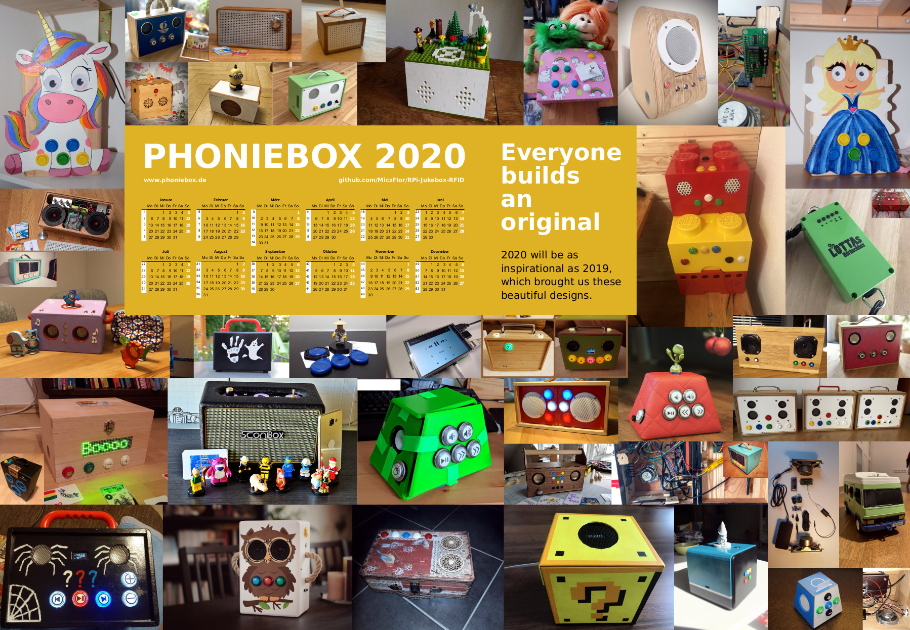
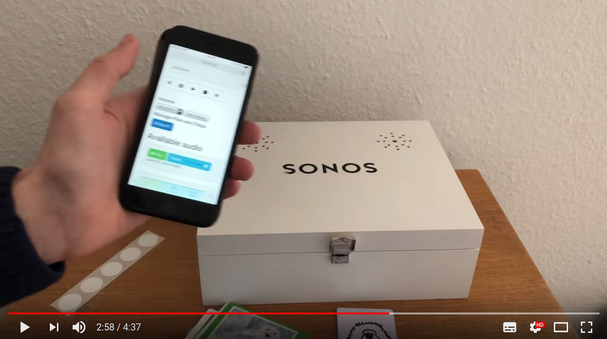
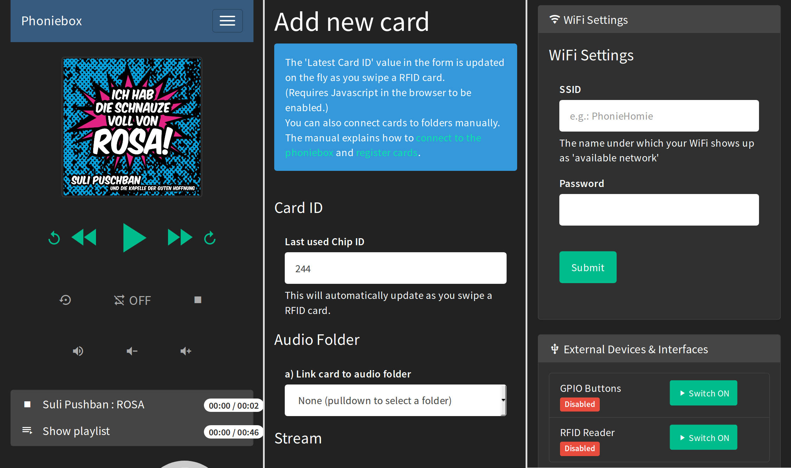
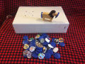
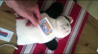
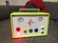
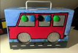

  

# Phoniebox: the RPi-Jukebox-RFID

A contactless jukebox for the Raspberry Pi, playing audio files, playlists, podcasts, web streams and spotify triggered by RFID cards. All plug and play via USB, no soldering iron needed. Update: if you must, it now also features a howto for adding GPIO buttons controls.

## Important updates / news

* **Gitter Community** we got ourselves a gitter community; chat us up at https://gitter.im/phoniebox

* **Phoniebox [2.0](https://github.com/chbuehlmann/RPi-Jukebox-RFID/milestone/1?closed=1) released (2020-05-24)**

The 2.0 release was pushed through the doors with *countless additions and great oversight* from @s-martin and *substantial input* by @ZyanKLee together alongside many other contributors (some of which in alphabetical order): @andreasbrett @BerniPi @ctietze @danielhammer @fredg02 @Groovylein @MalteHST @patrickweigelt @Piehti @SimonChelkowski @veloxidSchweiz @xn--nding-jua and starring @splitti as *the great hotfix*. [List of all contributors](https://github.com/chbuehlmann/RPi-Jukebox-RFID/graphs/contributors)

## What's new in version 2.0?

* **[WiFi management](https://github.com/chbuehlmann/RPi-Jukebox-RFID/wiki/MANUAL#wifi-settings)**
    * RFID cards to **toggle Wifi** (or switch it on/off)
    * Read out the Wifi IP address (if you are connecting to a new network and don't know where to point your browser)
    * **Hotspot** Phoniebox: [ad-hoc hotspot](https://github.com/chbuehlmann/RPi-Jukebox-RFID/pull/967) if no known network found (IP: 10.0.0.5 SSID: phoniebox Password: PlayItLoud)
* **Touchscreen** LCD display Player (file: `index-lcd.php`in web app)
* [GPIO control](components/gpio_control/README.md) for improved hadling of GPIO devices (buttons, rotary control, ...)
* Improved [PN532](components/rfid-reader/PN532/README.md) RFID reader support
* Improved **one-line install script** featuring *non-interactive* installs based on a config file
* Updated all **python code to 3.5** and consistent use of packages via requirements.txt files
* Migration to **mopidy3** for Spotify and [Google Music](https://github.com/chbuehlmann/RPi-Jukebox-RFID/wiki/Enable-Google-Play-Music-GMusic) integration
* Improved development life cycle (**unit tests**, checkers, continous integration, ...)
* ... and many bug fixes (as well as new bugs, we don't know yet)

**What's still hot?**

* Integrate your [Phoniebox in your Smart Home](https://github.com/chbuehlmann/RPi-Jukebox-RFID/issues/581).
* Smoother [Web App running on ajax](https://github.com/chbuehlmann/RPi-Jukebox-RFID/pull/623).
* New [search form for local files](https://github.com/chbuehlmann/RPi-Jukebox-RFID/pull/710)
* The **one-line install script** handles both: **Classic** and **+Spotify** when [setting up your Phoniebox](https://github.com/chbuehlmann/RPi-Jukebox-RFID/wiki/INSTALL-stretch#one-line-install-command).
* Control the debug logs in the web app (individual scripts switched on/off, empty log file).
* Set [maximum volume with RFID](https://github.com/chbuehlmann/RPi-Jukebox-RFID/pull/633) cards.
* Control via [**wifi web app**](https://github.com/chbuehlmann/RPi-Jukebox-RFID/wiki/MANUAL#webapp) from your phone, tablet or PC. You can play, upload, move files, assign new RFID cards, control playout, settings, etc.
* [**RFID** control](https://github.com/chbuehlmann/RPi-Jukebox-RFID/wiki/MANUAL#phoniebox-controls-using-rfid-cards) for playout and controlling your Phoniebox.
* [Playout **Resume**](https://github.com/chbuehlmann/RPi-Jukebox-RFID/wiki/MANUAL#manage-playout-behaviour) switch for audio books, allowing you to jump straight back to where you were (unless you fell asleep...).
* Playout **Shuffle** switch to mix up your playlists.
* Download from **YouTube** directly to your Phoniebox.
* Support for **[Spotify](https://github.com/chbuehlmann/RPi-Jukebox-RFID/wiki/Spotify-FAQ)** and **[Google Play Music](https://github.com/chbuehlmann/RPi-Jukebox-RFID/wiki/Enable-Google-Play-Music-GMusic)** integration.
* **Podcasts!** More for myself than anybody else, I guess, I added the [podcast feature for Phoniebox](https://github.com/chbuehlmann/RPi-Jukebox-RFID/wiki/MANUAL#podcasts) (2018-05-09)
* [Buttons](https://github.com/chbuehlmann/RPi-Jukebox-RFID/wiki/Using-GPIO-hardware-buttons) and [knobs / dials](https://github.com/chbuehlmann/RPi-Jukebox-RFID/wiki/Audio-RotaryKnobVolume) to control your **Phoniebox via GPIO**.
    
### Quick install
   
[One line install script](https://github.com/chbuehlmann/RPi-Jukebox-RFID/wiki/INSTALL-stretch#one-line-install-command) for Raspbian `buster` available.

* **MUST READ for users of [Phoniebox +Spotify Edition](docs/SPOTIFY-INTEGRATION.md)**
* This install script combines the two versions *Classic* and *+ Spotify*. 
* *Phoniebox Classic* supports local audio, web radio, podcasts, YouTube (download and convert), GPIO and/or RFID

Documentation can be found in the [GitHub wiki for Phoniebox](https://github.com/chbuehlmann/RPi-Jukebox-RFID/wiki). Please try to add content in the wiki regarding special hardware, software tweaks and the like.

## The 2020 Phoniebox Calendar is out!

Celebrating all the great designs of 2019, I put together a calendar for 2020, see picture above. If you want to be featured on next years calendar, please make sure to add your Phoniebox pics to the [design thread here on github](https://github.com/chbuehlmann/RPi-Jukebox-RFID/issues/639).

The PDF is about 6MB and will print well on A2 paper size, but it should also look good on larger poster sizes. Thanks to all the contributors, designers and makers. Have a good start into 2020 and keep up the good work!

* [Download the 2020 Phoniebox Calendar PDF here](https://drive.google.com/file/d/1krb8G8Td1Vrf3sYWl44nZyuoJ0DIC5vX/view?usp=sharing)
* In case you missed it, [download the 2019 Phoniebox Calendar PDF here](https://drive.google.com/file/d/1NKlertLP0nIKOsHrcqu5pxe6NZU3SfS9/view?usp=sharing)

---

<!--a href="https://www.paypal.com" target="_blank"></a-->

If you like your Phoniebox, consider to [buy me a coffee](https://www.buymeacoffee.com/MiczFlor)
or donate via [PayPal](https://www.paypal.com) to micz.flor@web.de using the *friends* option. 

---

*See the Phoniebox code in action, watch this video and read the blog post from [iphone-ticker.de](https://www.iphone-ticker.de/wochenend-projekt-kontaktlose-musikbox-fuer-kinder-123063/)*

**We love Tech** published a video screencast on *how to build your Phoniebox* (in German), you can find all the steps and see the final product here:

|  |  |   |
| --- | --- | --- |
| <a href="https://youtu.be/spHDGSxckmw" target="_blank"> Installation und Hardware</a> | <a href="https://youtu.be/9ZSKFoWr9WY" target="_blank"> Web App and Audio / Spotify</a> | <a href="https://youtu.be/YucQuwUD7XE" target="_blank"> The finished Phoniebox in action</a> |

A new video screencast about 

**What makes this Phoniebox easy to install and use:**

* Runs on all Raspberry Pi models (1, 2 and 3) and [Raspberry Zero](https://github.com/chbuehlmann/RPi-Jukebox-RFID/issues/15). (jump to the [install instructions](#install))
* Just plug and play using USB, no soldering iron needed.
* Once the Phoniebox is up and running, add music from any computer on your home network.
* Register new RFID cards easily without having to connect to the RPi.
* Play single or multiple files, podcasts or web streams.
* Volume control is also done with RFID cards or key fobs.
* Connect to your Phoniebox via your wifi network or run the Phoniebox like an access point and connect directly without a router.
* **Bonus:** control the Phoniebox from your phone or computer via a web app.

The **web app** runs on any device and is mobile optimised. It provides:

* An audio player to pause, resume, shuffle, loop, stop and skip to previous and next track.
* Sub folder support: manage your collection in sub folders. Phoniebox has two play buttons: only this folder and eeeeverything in this folder.
* Manage files and folders via the web app.
* Register new RFID cards, manage Phoniebox settings, display system info and edit the wifi connection.
* Covers displayed in the web app (files called `cover.jpg`).

## Phoniebox Gallery

|  |  |   |   |   |   |
| --- | --- | --- | --- | --- | --- |
|  |  |  |  |  |  | 

**See more innovation, upcycling and creativity in the [Phoniebox Gallery](https://github.com/chbuehlmann/RPi-Jukebox-RFID/wiki/GALLERY) or visit and share the project's homepage at [phoniebox.de](http://phoniebox.de/). There is also an [english Phoniebox page](http://phoniebox.de/index.php?l=en).**

## Installation

* Installation instructions for Raspbian (https://github.com/chbuehlmann/RPi-Jukebox-RFID/wiki/INSTALL-stretch).
* You can also use the [headless installation over ssh](https://github.com/chbuehlmann/RPi-Jukebox-RFID/wiki/INSTALL-stretch#ssh-install) straight from a fresh SD card.
* For a quick install procedure, take a look at the [bash one line install script for stretch and buster](https://github.com/chbuehlmann/RPi-Jukebox-RFID/wiki/INSTALL-stretch#one-line-install-command). This should get you started quickly.
* If you choose the step by step installation, you need to walk through the configuration steps for [Stretch](https://github.com/chbuehlmann/RPi-Jukebox-RFID/wiki/CONFIGURE-stretch).
* Once everything has been installed and configured, [read the manual](https://github.com/chbuehlmann/RPi-Jukebox-RFID/wiki/MANUAL) to change settings, register RFID cards, add audio.

Adding push buttons to control volume, skipping tracks, pause, play: read the [GPIO buttons installation guide](docs/GPIO-BUTTONS.md).

### Components

Special hardware is now organised in the folder [`components`](https://github.com/chbuehlmann/RPi-Jukebox-RFID/tree/master/components). If you have new hardware attached to your Phoniebox, please add to this library! It currently contains soundcards, displays, GPIO controls, RFID reader, smarthome integration.

## Manual

In the [Manual](https://github.com/chbuehlmann/RPi-Jukebox-RFID/wiki/MANUAL) you will learn:

* [How to connect to the Phoniebox from any computer to add and edit audio files.](https://github.com/chbuehlmann/RPi-Jukebox-RFID/wiki/MANUAL#connect)
* [How to register new RFID cards, assign them a *human readable* shortcut and add audio files for each card.](https://github.com/chbuehlmann/RPi-Jukebox-RFID/wiki/MANUAL#registercards)
* [How to add webradio stations and other streams to the playout files](https://github.com/chbuehlmann/RPi-Jukebox-RFID/wiki/MANUAL#webstreams) - [and even mix web based and local files.](https://github.com/chbuehlmann/RPi-Jukebox-RFID/wiki/MANUAL#mixwebstreams)
* [Adding Podcasts the your Phoniebox](https://github.com/chbuehlmann/RPi-Jukebox-RFID/wiki/MANUAL#podcasts)
* [How to control the Phoniebox through the web app.](https://github.com/chbuehlmann/RPi-Jukebox-RFID/wiki/MANUAL#webapp)
* [How to assign cards specific tasks such as changing the volume level or shutting down the Phoniebox.](https://github.com/chbuehlmann/RPi-Jukebox-RFID/wiki/MANUAL#cardcontrol)

## Contributing improvements

Read the [CONTRIBUTING.md](CONTRIBUTING.md) file for [more infos on how to contribute code](CONTRIBUTING.md).

## Reporting bugs

To make maintenance easier for everyone, please run the following script 
and post the results when reporting a bug.
(Note: the results contain some personal information like IP or SSID.
You might want to erase some of it before sharing with the bug report.)
~~~
/home/pi/RPi-Jukebox-RFID/scripts/helperscripts/Analytics_AfterInstallScript.sh 
~~~
Just copy this line and paste it into your terminal on the pi.

If you find something that doesn't work. And you tried and tried again, but it still doesn't work, please report your issue in the ["issues" section](https://github.com/chbuehlmann/RPi-Jukebox-RFID/issues). Make sure to include information about the system and hardware you are using, like: 

*Raspberry ZERO, OS Jessie, Card reader lists as (insert here) when running scripts/RegisterDevice.py, installed Phoniebox version 0.9.3 (or: using latest master branch).*

## Troubleshooting

There is a growing section of [troubleshooting](https://github.com/chbuehlmann/RPi-Jukebox-RFID/wiki/MANUAL#faq) including:

* I want to improve the onboard audio quality
* I am moving, how do I get the Phoniebox into my new WiFi network?
* The RFID Reader doesn't seem to work.
* Changing the volume does not work, but the playout works.
* Script `daemon_rfid_reader.py` only works via SSH not by RFID cards.
* Script daemon is closing down unexpectedly.
* Everything seems to work, but I hear nothing when swiping a card.
* I would like to use two cards / IDs to do the same thing.

## Acknowledgments

There are many, many, many inspiring suggestions and solutions on the web to bring together the idea of a jukebox with RFID cards. I want to mention a few of these that have inspired me.

* Thanks to all the [contributors](https://github.com/chbuehlmann/RPi-Jukebox-RFID/graphs/contributors). Not only for the good code review and feature suggestions, but also for the good spirit I get each time a new Phoniebox comes to this world :)
* Thanks to Andreas aka [hailogugo](https://github.com/hailogugo) for writing and testing the script for the [GPIO buttons as controllers for the jukebox](docs/GPIO-BUTTONS.md).
* [Francisco Sahli's Music Cards: RFID cards + Spotify + Raspberry Pi](https://fsahli.wordpress.com/2015/11/02/music-cards-rfid-cards-spotify-raspberry-pi/) written in python, playing songs from Spotify. The code [music-cards](https://github.com/fsahli/music-cards) is on GitHub.
* [Jeremy Lightsmith's rpi-jukebox](https://github.com/jeremylightsmith/rpi-jukebox) written in Python, using the mpg123 player
* [Marco Wiedemeyer's Raspberry Pi Jukebox für Kinder (German)](https://blog.mwiedemeyer.de/post/Raspberry-Pi-Jukebox-fur-Kinder/) written in mono, using the MPD player
* [Marcus Nasarek's Kindgerechter Audioplayer mit dem Raspberry Pi (German)](http://www.raspberry-pi-geek.de/Magazin/2014/03/Kindgerechter-Audioplayer-mit-dem-Raspberry-Pi) triggered by QR codes via a camera instead of RFID cards, written in bash and using the xmms2 media player
* [Huy Do's jukebox4kids / Jukebox für Kinder](http://www.forum-raspberrypi.de/Thread-projekt-jukebox4kids-jukebox-fuer-kinder) written in Python, [the code is on github](https://github.com/hdo/jukebox4kids)
* [Willem van der Jagt's How I built an audio book reader for my nearly blind grandfather](http://willemvanderjagt.com/2014/08/16/audio-book-reader/) written in python and using the MDP player.

I also want to link to two proprietary and commercial projects, because they were an inspiration in the early days of the Phoniebox. Since the first release, the Phoniebox code has shown the power of open source development. Today, Phoniebox might be the most versatile project of its kind.

* [tonies® - das neue Audiosystem für mehr Hör-Spiel-Spaß im Kinderzimmer. (German)](https://tonies.de/) You buy a plastic figure which then triggers the audiofile - which is served over the web.
* [Hörbert - a MP3 player controlled by buttons](https://hoerbert.com) In Germany this has already become a *classic*. They also started selling a DIY kit.

---

If you like your Phoniebox, consider to [buy me a coffee](https://www.buymeacoffee.com/MiczFlor)

---

## Shopping list

Here is a list of equipment needed. You can find a lot second hand online (save money and the planet). The links below lead to amazon, not at all because I want to support them, but because their PartnerNet program helps to support the Phoniebox maintenance (a little bit...). **Note: depending on individual projects, the hardware requirements vary.**

### Raspberry Pi

* [Raspberry Pi 4 Modell B](https://amzn.to/2Yuei04)
* [Raspberry Pi 3 Model B](https://amzn.to/3fqp8ef)
* [Raspberry Pi Zero WH](https://amzn.to/3fkfKc5)
* Note: You might be surprised how easy and affordable you can get an RPi second hand. Think about the planet before you buy a new one.

### RFID Reader and cards / fobs

* RFID Card Reader (USB): [Neuftech USB RFID Reader ID](https://amzn.to/2RrqScm) using 125 kHz - make sure to buy compatible cards, RFID stickers or key fobs working with the same frequency as the reader. **Important notice:** the hardware of the reader that I had linked here for a long times seems to have changed and suddenly created problems with the Phoniebox installation. The reader listed now has worked and was recommended by two Phoniebox makers (2018 Oct 4). I can not guarantee that this will not change and invite you to give [RFID Reader feedback in this thread](https://github.com/chbuehlmann/RPi-Jukebox-RFID/issues/231).
    * RFID cards: [125 KHz EM4100](https://amzn.to/37pjy9q) make sure the frequency matches the RFID card reader !!!  
    * RFID fobs / key rings: [EM4100 RFID-Transponder-Schlüsselring, 125 KHz](https://amzn.to/3hsuvLO) make sure the frequency matches the RFID card reader !!!  

* RFID Kit RC522: [RC522 Reader, Chip, Card for Raspberry Pi 13.56MHz] (https://amzn.to/2C7YZCZ)
    * RFID sticker / tags: [MIFARE RFID NFC Tags](https://amzn.to/30GfLDg) untested by me personally, but reported to work with work with RC522 and PN532 card readers.  
    
### Speakers / amps

* [USB Stereo Speaker Set (6 Watt, 3,5mm jack, USB-powered) black](http://amzn.to/2kXrard) | This USB powered speaker set sounds good for its size, is good value for money and keeps this RPi project clean and without the need of a soldering iron :)
* [USB A Male to Female Extenstion Cable with Switch On/Off](http://amzn.to/2hHrvkG) | I placed this USB extension between the USB power adapter and the Phoniebox. This will allow you to switch the Phoniebox on and off easily.
* [USB 2.0 Hub 4-port bus powered USB Adapter](http://amzn.to/2kXeErv) | Depending on your setup, you will need none, one or two of these. If you are using the external USB powered speakers, you need one to make sure the speakers get enough power. If you want to use the additional USB soundcard and have an older RPi, you might need a second one to make sure you can connect enough devices with the RPi.

### Arcade Buttons

* Arcade Buttons / Sensors (one of these might suit you)
    * [Arcade Buttons / Schalter in various colours](https://amzn.to/2QMxe9r) if you want buttons for the GPIO control.
    * [Arcade Buttons wit LED and custom icons](https://amzn.to/2MWQ6hq) as used by [@splitti](https://splittscheid.de/selfmade-phoniebox/#3C).
    * [Set: Arcade Buttons / Tasten / Schalter ](https://amzn.to/2T81JTZ) GPIO Extension Board Starter Kit including cables and breadboard.
    * [Touch Sensor / Kapazitive Touch Tasten ](https://amzn.to/2Vc4ntx) these are not buttons to press but to touch as GPIO controls.

### Special hardware

These are links to additional items, which will add an individual flavour to your Phoniebox setup. Consult the issue threads to see if your idea has been realised already. 

* [Ground Loop Isolator / Entstörfilter Audio](https://amzn.to/2Kseo0L) this seems to [get rid off crackles in the audio out (a typical RPi problem)](https://github.com/chbuehlmann/RPi-Jukebox-RFID/issues/341) 
* [Mechanical audio switch](https://amzn.to/35oOSCS) if you want to connect differen audio devices, this is the easiest way (in connection with the *Ground Loop Isolator* you will get good results)
* [Rotary Encoder / Drehregler / Dial](https://amzn.to/2J34guF) for volume control. Read here for more information on how to [integrate the rotary dial](https://github.com/chbuehlmann/RPi-Jukebox-RFID/issues/267) 
* [HiFiBerry DAC+ Soundcard](https://amzn.to/2J36cU9) Read here for more information on how to [HifiBerry Soundcard integration](https://github.com/chbuehlmann/RPi-Jukebox-RFID/wiki/MANUAL#hifiberry-dac-soundcard-details)
* [HDMI zu HDMI + Optisches SPDIF mit 3,5-mm-Stereo-HDMI Audio-Extractor | HDMI zu SPDIF Konverter](https://amzn.to/2N8KP8C) If you plan to use video, this might be the better solution than a USB soundcard or the hifiberry. If takes up some space, but will work with the HDMI audio out and split the signal to deliver audio through 3.5mm jack.
