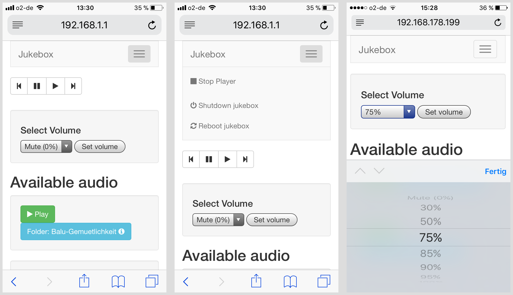

# Phoniebox: the RPi-Jukebox-RFID
A contactless jukebox for the Raspberry Pi, playing local audio files, playlists or even web streams triggered by RFID cards. All plug and play via USB, no soldering iron needed. Update: if you must, it now also features a howto for adding GPIO buttons controls.

*Important update news*

* **Podcasts!** More for myself than anybody else, I guess, I added the [podcast feature for Phoniebox](docs/MANUAL.md#podcasts) (2018-05-09)
* **`config.php` removed in repo** To fix a flaw of the initial commit, I removed the `config.php` file from the `htdocs` directory. It will be created automatically from `config.php.sample`. If you encounter problems after `git pull`, download [`config.php.sample`](https://github.com/MiczFlor/RPi-Jukebox-RFID/blob/master/htdocs/config.php.sample) adjust and copy to `config.php`. (2018-05-03)
* **NEW: Upgrade information** please see [`UPGRADE.md`](docs/UPGRADE.md) for details on upgrading (2018-05-29)

---

*See the jukebox code in action, watch this video and read the blog post from [iphone-ticker.de](https://www.iphone-ticker.de/wochenend-projekt-kontaktlose-musikbox-fuer-kinder-123063/)*

**What makes this jukebox easy to install and use:**

* Runs on all Raspberry Pi models (1, 2 and 3) and [Raspberry Zero](https://github.com/MiczFlor/RPi-Jukebox-RFID/issues/15).
* Just plug and play using USB, no soldering iron needed.
* Once the jukebox is up and running, add music from any computer on your home network.
* Register new RFID cards easily without having to connect to the RPi.
* Play single or multiple files, even mix them with web streams.
* Volume control is also done with RFID cards or key fobs.
* Connect to your jukebox via your wifi network or run the jukebox like an access point and connect directly without a router.
* **Bonus:** control the jukebox from your phone or computer via a web app.

The web app runs on any device and is mobile optimised. It provides:

* An audio player to pause, resume, stop and skip to previous and next track.
* Control and change the volume level.
* Full list of all available audio and trigger to play it from the browser.
* Shutdown or reboot the RPi gracefully.

## Jukebox Gallery

|  |  |   |   |   |   |
| --- | --- | --- | --- | --- | --- |
|  |  |  |  |  |  | 

**See more innovation, upcycling and creativity in the [Jukebox Gallery](docs/GALLERY.md) or visit and share the project's homepage at [phoniebox.de](http://phoniebox.de/). There is also an [english Phoniebox page](http://phoniebox.de/index.php?l=en).**

## Installation

* Installation instructions for Raspbian [Jessie](docs/INSTALL-jessie.md) and [Stretch](docs/INSTALL-stretch.md) are available in the `docs` folder. (experts might take a look at the [install script for Jessie](https://github.com/MiczFlor/RPi-Jukebox-RFID/blob/master/scripts/installscripts/jessie-install-default-01.sh)) or [install script for Stretch](https://github.com/MiczFlor/RPi-Jukebox-RFID/blob/master/scripts/installscripts/stretch-install-default-01.sh)).
* Then walk through the configuraton for [Jessie](docs/CONFIGURE-jessie.md) or [Stretch](docs/CONFIGURE-stretch.md).
* Once everything is set up and configured, read the manual to register cards and add audio: [`MANUAL.md`](docs/MANUAL.md)

Adding push buttons to control volume, skipping tracks, pause, play: read the [GPIO buttons installation guide](docs/GPIO-BUTTONS.md).

*A German version for the installation ... hier ist eine etwas überholte [deutsche Version der Installationsdoku für Jessie](http://docplayer.org/68280452-Anleitung-jukebox-kinder-https-github-com-miczflor-rpi-jukebox-rfid-mit-buttons-und-hifiberry-miniamp.html) von [hailogugo](https://forum-raspberrypi.de/user/51824-hailogugo/)* 

## Manual

In [`MANUAL.md`](docs/MANUAL.md) you will learn:

* [How to connect to the jukebox from any computer to add and edit audio files.](docs/MANUAL.md#connect)
* [How to register new RFID cards, assign them a *human readable* shortcut and add audio files for each card.](docs/MANUAL.md#registercards)
* [How to add web radios, YouTube and other streams to the playout files](docs/MANUAL.md#webstreams) - [and even mix web based and local files.](docs/MANUAL.md#mixwebstreams)
* [Adding Podcasts the your Phoniebox](docs/MANUAL.md#podcasts)
* [How to control the jukebox through the web app.](docs/MANUAL.md#webapp)
* [How to assign cards specific tasks such as changing the volume level or shutting down the jukebox.](docs/MANUAL.md#cardcontrol)

## Contributing improvements

The preferred way of code contributions are [pull requests (follow this link for a small howto)](https://www.digitalocean.com/community/tutorials/how-to-create-a-pull-request-on-github). And ideally pull requests using the "running code" on your jukebox. Alternatively, feel free to post tweaks, suggestions and snippets in the ["issues" section](https://github.com/MiczFlor/RPi-Jukebox-RFID/issues).

## Reporting bugs

If you find something that doesn't work. And you tried and tried again, but it still doesn't work, please report your issue in the ["issues" section](https://github.com/MiczFlor/RPi-Jukebox-RFID/issues). Make sure to include information about the system and hardware you are using, like: 

*Raspberry ZERO, OS Jessie, Card reader lists as (insert here) when running scripts/RegisterDevice.py, installed jukebox version 0.9.3 (or: using latest master branch).*

## Troubleshooting

There is a growing section of [troubleshooting](docs/MANUAL.md#faq) including:

* How do I get the jukebox into a new WiFi network?
* The `amixer` command requires different device name, not `PCM`
* Script `daemon_rfid_reader.py` only works via SSH not by RFID cards
* Script daemon is closing down unexpectedly

## Acknowledgments

There are many, many, many inspiring suggestions and solutions on the web to bring together the idea of a jukebox with RFID cards. I want to mention a few of these that have inspired me.

* Thanks to Andreas aka [hailogugo](https://github.com/hailogugo) for writing and testing the script for the [GPIO buttons as controllers for the jukebox](docs/GPIO-BUTTONS.md).
* [Francisco Sahli's Music Cards: RFID cards + Spotify + Raspberry Pi](https://fsahli.wordpress.com/2015/11/02/music-cards-rfid-cards-spotify-raspberry-pi/) written in python, playing songs from Spotify. The code [music-cards](https://github.com/fsahli/music-cards) is on GitHub.
* [Jeremy Lightsmith's rpi-jukebox](https://github.com/jeremylightsmith/rpi-jukebox) written in Python, using the mpg123 player
* [Marco Wiedemeyer's Raspberry Pi Jukebox für Kinder (German)](https://mwiedemeyer.de/blog/post/Raspberry-Pi-Jukebox-fur-Kinder) written in mono, using the MPD player
* [Marcus Nasarek's Kindgerechter Audioplayer mit dem Raspberry Pi (German)](http://www.raspberry-pi-geek.de/Magazin/2014/03/Kindgerechter-Audioplayer-mit-dem-Raspberry-Pi) triggered by QR codes via a camera instead of RFID cards, written in bash and using the xmms2 media player
* [Huy Do's jukebox4kids / Jukebox für Kinder](http://www.forum-raspberrypi.de/Thread-projekt-jukebox4kids-jukebox-fuer-kinder) written in Python, [the code is on github](https://github.com/hdo/jukebox4kids)
* [Willem van der Jagt's How I built an audio book reader for my nearly blind grandfather](http://willemvanderjagt.com/2014/08/16/audio-book-reader/) written in python and using the MDP player.

For my rendition of the RFID jukebox, I have forked two files from [Francisco Sahli](https://github.com/fsahli/music-cards) to register the RFID reader and read the ID from the cards with the python scripts `Reader.py` and `RegisterDevice.py`.

I also want to link to two proprietary and commercial projects, because they also inspired me. And they challenged me, because of their shortcomings in terms of openness and in the case of tonies, the lack of "ownership" of the audiobooks and plays you actually bought. However, both products are very well made.

* [tonies® - das neue Audiosystem für mehr Hör-Spiel-Spaß im Kinderzimmer. (German)](https://tonies.de/) You buy a plastic figure which then triggers the audiofile - which is served over the web.
* [Hörbert - a MP3 player controlled by buttons](https://hoerbert.com) In Germany this has already become a *classic*. They also started selling a DIY kit.

## Shopping list

Here is a list of equipment needed. Chances are that you will find most of it in the back of your drawers or at the bottom of some shoe box. Well, most of it, possibly not the RFID reader itself.

* [Raspberry Pi 3 Model B ](http://amzn.to/2ku0PU7) | You might be surprised how easy and affordable you can get an RPi second hand. Think about the planet before you buy a new one.
* [Contactless RFID IC Card Reader with USB Interface PLUS 5 Cards + 5 Key Fob](http://amzn.to/2kXkMjr) | This package is good value for money, because it gets you started, including everything plus 5 RFID cards and 5 key fobs. 
* [USB Stereo Speaker Set (6 Watt, 3,5mm jack, USB-powered) black](http://amzn.to/2kXrard) | This USB powered speaker set sounds good for its size, is good value for money and keeps this RPi project clean and without the need of a soldering iron :)
* [External USB Soundcard with Virtual Surround Sound, Plug & Play](http://amzn.to/2kXflBf) | The additional soundcard is optional. If you don't like the sound coming straight from the RPi jack, this is a good value for money USB soundcard.
* [USB A Male to Female Extenstion Cable with Switch On/Off](http://amzn.to/2hHrvkG) | I placed this USB extension between the USB power adapter and the jukebox. This will allow you to switch the jukebox on and off easily.
* [USB 2.0 Hub 4-port bus powered USB Adapter](http://amzn.to/2kXeErv) | Depending on your setup, you will need none, one or two of these. If you are using the external USB powered speakers, you need one to make sure the speakers get enough power. If you want to use the additional USB soundcard and have an older RPi, you might need a second one to make sure you can connect enough devices with the RPi.
