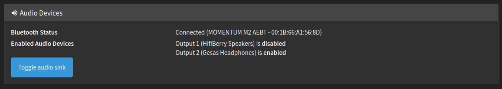

## Neatly switch between soundcard and bluetooth audio output

**Wouldn't it be nice to have regular speakers and Bluetooth headphones on your Phoniebox and choose the desired output on a spur of the moment?**

This component provides a mechanism to toggle between both audio sinks through all the usual user interfaces (i.e. GPIO, RFID Card Swipe, Web Interface). The current status is reflected in the Web Interface and through an optional LED.

**Convinced? So, what is the vision?**

When a user powers on their Bluetooth headphones, they connect automatically to the Phoniebox. At the switch of the button (or card swipe, etc) the (already running) audio playback is transferred from the speakers to the headphones. This happens almost seamlessly. Parents feel an instant wave of relief at not having to listen to the 500th iteration of this month favourite song. The small user feels instantly proud at having working headphones much like the mom/dad always uses while doing home-office online meetings. If no Bluetooth headphones are connected, the audio sink toggle request defaults to speakers. An LED indicates the currently active audio sink.

If the feature [bluetooth-buttons](../control/bluetooth-buttons) is enabled the audio stream is automatically switched over to bluetooth on connect and back to speakers on disconnect.

If no bluetooth device is connected, the output defaults back to speakers. After boot-up the output is always speakers to make sure start-up sound are audiable and to avoid confusion.

**Limitations**

This feature only works for the *Classic* Edition. Why? It relies on the mpd multiple output channels feature to switch between outputs. This is no available in mopidy, which is used in the Spotify Edition.

### Installation

This looks lengthy, but I the major deal is setting up your audio output devices. I have been rather explicit to avoid confusion.

#### Step 1) Setting up asound.conf

You need to set up both audio sinks and make sure they work. This is pretty much a prerequisite for everything that follows. 

Follow the instructions for your soundcard. Configure `/etc/asound.conf`correctly. And make sure it works!

Then follow the instructions on the [Wiki on how to connect the bluetooth device](https://github.com/MiczFlor/RPi-Jukebox-RFID/wiki/Bluetooth). We diverge where we set up two audio sinks instead of one: Just **add** the `pcm.btspeaker` section described in the wiki  to `/etc/asound.conf` (choose a name to your liking). Do **not** touch the mpd.conf yet!

The new entry should end up looking like this:
~~~
pcm.btheadphone {
    type plug
    slave.pcm {
        type bluealsa
        service "org.bluealsa"
        device "C4:FB:20:63:A7:F2"
        profile "a2dp"
        delay -20000
    }
    hint {
        show on
        description "Gesas Headphones"
    }
}
~~~

In case of doubt, reboot.

Test the new audio device (mine is called `pcm.btheadphone`). Also test the soundcard (here `pcm.hifiberry` for the regular speakers).
~~~sh
$ aplay -D btheadphone /usr/share/sounds/alsa/Front_Center.wav 
$ aplay -D hifiberry /usr/share/sounds/alsa/Front_Center.wav
~~~

#### Step 2) Setting up mpd.conf

You need to set up two audio_output sections. **The order is important**: the first entry must relate to the soundcard setup, the second entry must relate to the bluetooth setup. Give meaningful names, as they will show up in the Web Interface.

~~~
# The first entry should match your soundcard. If you have a working setup, there is most likly no need to change it!
# As an exanple, here is my configuration for my HifiBerry MiniAmp.
audio_output {
        type             "alsa"
        name             "HifiBerry Speakers"   # This name will show up in the Web Interface Status 
        device           "hifiberry"            # This is the pcm.hifiberry device from the asound.conf. 
                                                # If you did not specify a name, but use the 'default', delete this entry
        auto_resample    "no"                   # Depends on your asound.conf. In doubt delete this line
        mixer_control    "Master"               # This is the iFace name, you will recognize from your Phoniebox installation
}

# The second entry belongs to the bluetooth device
audio_output {
        type            "alsa"
        name            "Gesas Headphones" # This name will show up in the Web Interface Status 
        device          "btheadphone"      # This is the pcm.btheadphone device from the asound.conf
        mixer_type      "software" 
        auto_resample   "no"
        auto_format     "no"
        enabled         "no"               # Default is disabled, keepin the soundcard as primary output
}
~~~

Restarting the mpd.service or else reboot. 

Check the setup:

~~~sh
$ mpc outputs
Output 1 (HifiBerry Speakers) is disabled
Output 2 (Gesas Headphones) is enabled
~~~

You may switch with `$ mpc enable only 1` and `$ mpc enable only 2`. Play some music and use these commands to check you mpd configuration. You should be able to switch the audio output between the two devices.

#### Step 3) Run the installer

This sets up the appropriate user rights and registers the component with global settings etc.

~~~sh
$ cd components/bluetooth-sink-switch
$ ./install-bt-sink-switch.sh
~~~

#### Step 4) Fine-tuning

**Status LED**

An optional status LED will be turned on if the audio sink is set to bluetooth. If a toggle command is issued, but no bluetooth device is connected, the LED will blink three times. Looks very neat, if you have a button with integrated LED. 

Open `bt-sink-switch.py` and edit the following lines. (Default is `led_pin=None`)
~~~python
# Uses BCM GPIO numbering, i.e. 'led_pin = 6' means GPIO6
# Set 'led_pin=None' to disable LED support (and no GPIO pin is blocked in this case)
led_pin = 6
~~~

**GPIO control**

If you want to toggle from a GPIO button (e.g. on GPIO5), add these lines to your `gpio_settings.ini`

~~~
[BluetoothToggle]
enabled: True
Type: Button
Pin: 5
pull_up: True
hold_time: 0.3
functionCall: functionCallBluetoothToggle
~~~

**RFID Card**

If you want to toggle by RFID card swipe, set the card id in `rfid_trigger_play.conf`, e.g.:

~~~
### Toggle between speakers and bluetooth headphones
CMDBLUETOOTHTOGGLE="1364237231134"
~~~

**Volume attenuation**

Speakers and Headphones can have very different maximum volume levels. This sometimes leads to very strong volume level changes when switching between speakers and headphones. Restricting the maximum volume with the Phoniebox-integrated max-volume setting does no yield the desired effect, as this is a single setting and does not differentiate between different audio sinks.

The solution is adding a `softvol` component to the /etc/asound.conf. You may already have one set up, if your soundcard does not have a hardware volume control. Then it is easy! The `softvol` copmonent adds a systemwide ALSA-based volume control for a hardware soundcard. You will need to give it a name, that does **not** exist! Check with `$ amixer scontrols` first, which names are already taken. Here, I have choosen *Master*. This will work even if your soundcard has a hardware volume control.

The `softvol` component has a feature called *max_db*  to limit the maximum volume, which we are going to utilize here. With that we are limiting the maximum volume of the speakers systemwide and independent of MPD or other Phoniebox settings. 

~~~
# Add the sofvol section
pcm.hifiberry {
    type softvol
    slave.pcm    "plughw:0,0" # Your audio output. Here: audio stream goes direclty to the soundcard 0
    control.name "Master"     # Unique, new iFace name not already used in the system
    control.card  0           # Be sure to also adjust the index to your soundcard number
                              # i.e. if your soundcard is plughw:1,0 this should also be 1
    max_dB       -20.0        # This limits the maximum speaker volume.
                              # Play around with this number until your are satisfied with the 
                              # volume change effect when switching between headphones and speakers
    hint {
         show on
         description "HifiBerry Speakers"
    }
}

# Setup the default device
pcm.!default {
    type             plug
    slave.pcm       "hifiberry"
}

ctl.!default {
  type hw card 0
}
~~~

**Attention:** This changes the iFace name! The new iFace name is now *Master*. You will need to adjust your mpd.conf in two places

- Change the mixer control to the new iFace name: `mixer_control    "Master"`
- Ensure that it is there is no entry mixer_type or that it is `mixer_type  "hardware"`

See example [mpd.conf](#step-2-setting-up-mpdconf) above! 

Also change the Phoniebox setting with 
~~~sh
$ echo "Master" >  RPi-Jukebox-RFID/settings/Audio_iFace_Name 
~~~
and reboot!

Test the setup with running speaker test in one console
~~~
$ speaker-test -D hifiberry
~~~
and changing the default volume control in another console
~~~
$ alsamixer 
~~~

If you are experimenting with a softvol and want to get rid of it again - that is not an easy task. Most promising approach is to insert the SD-Card into a different Linux machine delete the file `/var/lib/alsa/asound.state`. This must be done from a different computer, as this file gets written during shutdown. More infos about the softvol may be found [here](https://alsa.opensrc.org/Softvol)

## Troubleshooting 

Troubleshooting comes in three major sub-tasks:

- Step 1) Ensure that your asound.conf and mpd.conf configurations are working correclty by performing the checks described in the respective sections
- Step 2) Check that the script for stream toggling works. Call the script manually from console with debug output: `$ ./RPi-Jukebox-RFID/components/bluetooth-sink-switch/bt-sink-switch.py toggle debug`. And analyze the output
- Step 3) Check the actual user interface that you are going to use (e.g. GPIO buttons)

## Some background

https://alsa.opensrc.org/Softvol

https://alsa.opensrc.org/How_to_use_softvol_to_control_the_master_volume

https://www.alsa-project.org/alsa-doc/alsa-lib/pcm_plugins.html

## Example config

For reference, this is my /etc/asound.conf in full (it also sets up an equalizer). The corresponding [mpd.conf](#step-2-setting-up-mpdconf) excerpt is the one given above.

~~~
pcm.btheadphone {
    type plug
    slave.pcm {
      type bluealsa
   service "org.bluealsa"
  	device "00:1B:66:A1:56:8D"
  	profile "a2dp"
        delay -20000
    }
    hint {
        show on
        description "Gesas Headphones"
    }
}

pcm.hifiberry {
    type softvol
    slave.pcm equal
    control.name "Master"
    control.card 0
    max_dB -20.0
    hint {
         show on
         description "HifiBerry Speakers"
    }
}

pcm.!default {
   type asym
   playback.pcm "hifiberry"
}

ctl.!default {
  type hw card 0
}

ctl.equal {
  type equal;
}

pcm.equalcore {
  type equal;
  slave.pcm "plughw:0,0";
}

pcm.equal {
  type plug;
  slave.pcm equalcore;
}
~~~
