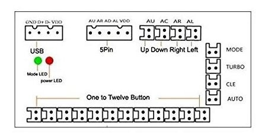

# Buttons USB Encoder

Supports functionality of buttons which are connected via USB Encoder. The USB Encoder is the easy solution for anyone
who doesn't want to solder, but also wants arcade buttons.

Tested Devices:

* [IGames Zero Verzögerung USB Encoder](https://www.amazon.de/gp/product/B01N0GZQZI)
* [EG STARTS Nullverzögerung USB Encoder](https://www.amazon.de/gp/product/B075DFNK24)
* [Dragonrise inc. generic usb joystick](https://de.aliexpress.com/item/1005001700497245.html)

## Installation

1. Plug in your USB Encoder. You don't need to install any drivers. After plugging in, the USB encoder acts like an
   input device.
2. Navigate to your RPi-Jukebox home directory and run the script `setup-buttons-usb-encoder.sh` to set up your USB Encoder. Then choose the device and map the buttons.

   `cd ~/RPi-Jukebox-RFID`

   `./components/controls/buttons_usb_encoder/setup-buttons-usb-encoder.sh`

If you make a mistake at the first install you can "remap" the buttons:

* Stop the service: `sudo systemctl stop phoniebox-buttons-usb-encoder.service`
* Run the installation script again: `./components/controls/buttons_usb_encoder/setup-buttons-usb-encoder.sh`
* Restart the service: `sudo systemctl start phoniebox-buttons-usb-encoder.service`

### Possible Button Mappings

* 'BluetoothToggle': Turn bluetooth on or off
* 'PlayerNext': Play Next
* 'PlayerPause': Pause
* 'PlayerPauseForce': Force Pause?
* 'PlayerPrev': Previous track
* 'PlayerRandomCard': Activate (play?) random card?
* 'PlayerRandomFolder': Play random folder
* 'PlayerRandomTrack': Play random track
* 'PlayerSeekBack': Seek backwards on playing track (x seconds)
* 'PlayerSeekFarBack': Seek backwards on playing track (x seconds)
* 'PlayerSeekFarFwd': Seek forwards on playing track (x seconds)
* 'PlayerSeekFwd': Seek forwards on playing track (x seconds)
* 'PlayerStop': Stop playing
* 'RecordPlayLatest': Play latest recording
* 'RecordStart': Start recording
* 'RecordStop': Stop recording
* 'Shutdown': Shut down the Phoniebox
* 'ToggleWifi': Turn Wifi on or off
* 'Vol0': Volume mute?
* 'VolD': Volume down
* 'VolU': Volume up

## Schematics

## Issues & Discussions

* <https://github.com/MiczFlor/RPi-Jukebox-RFID/issues/1156>
* <https://github.com/MiczFlor/RPi-Jukebox-RFID/discussions/2013>
