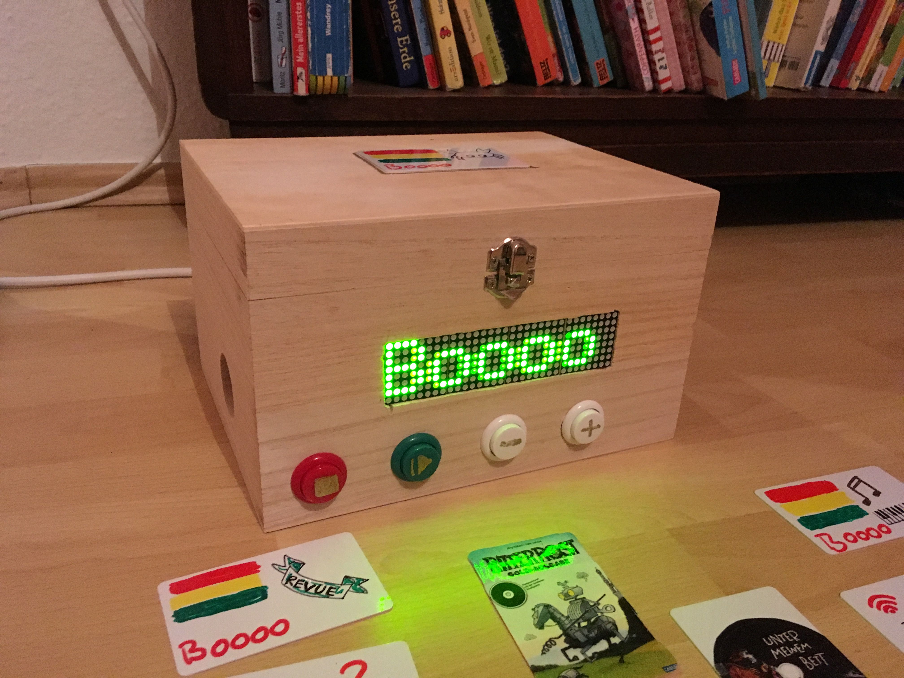
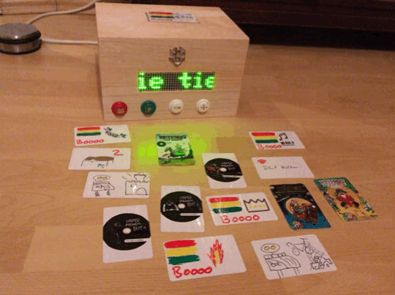

# MAX7219 Dot Matrix Display

## Items needed

* [NodeMCU ESP8266, CPU/WLAN](https://amzn.to/2urDAky)
* [MAX7219 dot matrix module microcontroller module 4 in one display](https://amzn.to/2Sa5Scx)

## Configuration

In the [display.ino](display.ino#L48-L50) there is following configuration part:

    const char* ssid = "foo";
    const char* password = "foo";
    const char* host = "192.168.42.42";

`ssid` is your local WiFi network. 
`password` is the password for your WiFi network. 
`host` is the **static** IP of your Phoniebox.

For flashing the ESP, you can use the [Arduino IDE](https://en.wikipedia.org/wiki/Arduino_IDE). But there are a few more other possibilities to do this.

## Pics

