# Jukebox Gallery
Because everybody is an individual - and so are their jukeboxes - I started this gallery. If you want to be part of it, either create a pull request or post your image to the [Pics of my jukebox](https://github.com/MiczFlor/RPi-Jukebox-RFID/issues/5) thread. I will copy them to the gallery.

|  |  |
| --- | --- |
| 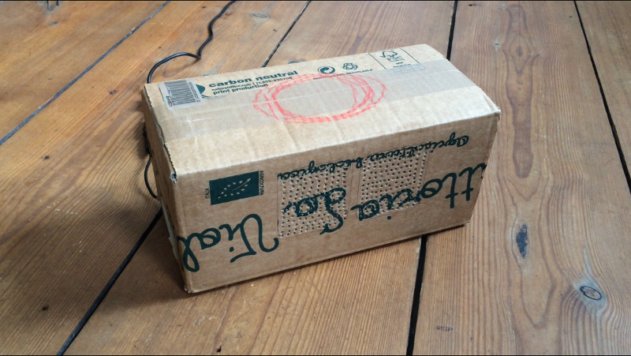 | 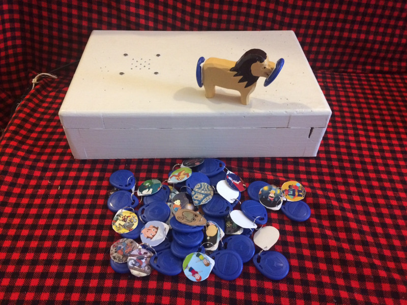 |
| The first *Alpha* version of the RFID Jukebox. Red marks the RFID reader. (Feb 2017) | The big wooden box provides a solid sound. Note the *skip lion* used to skip to next and previous tracks. (Aug 2017) |
| 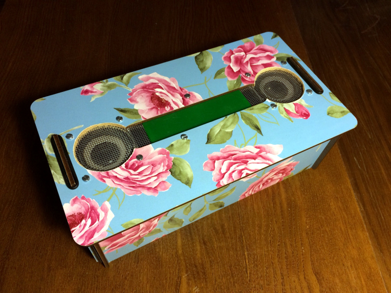 | 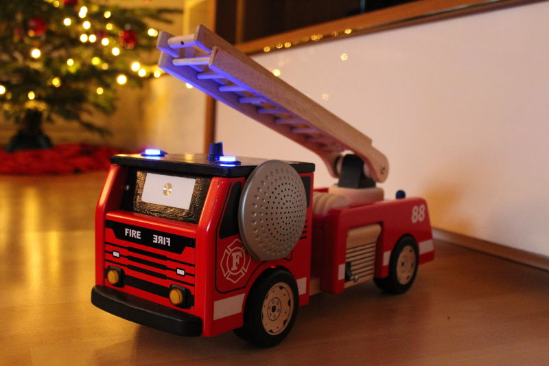 |
| A re-issued tissue box. Steph's neat design solution. (Dec 2017) | To grasp *all* the stuff [Geliras](https://github.com/Geliras)' fire engine can do, [watch the video](https://youtu.be/DbpXD0Y3a-Q). (Dec 2017) |
| 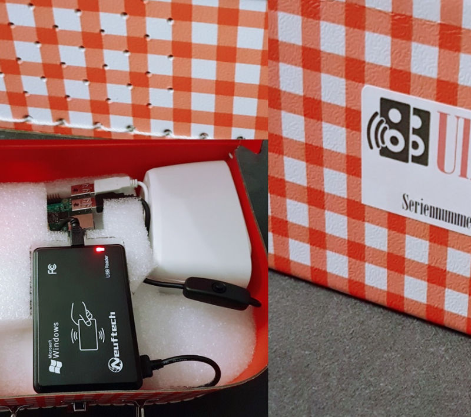 | 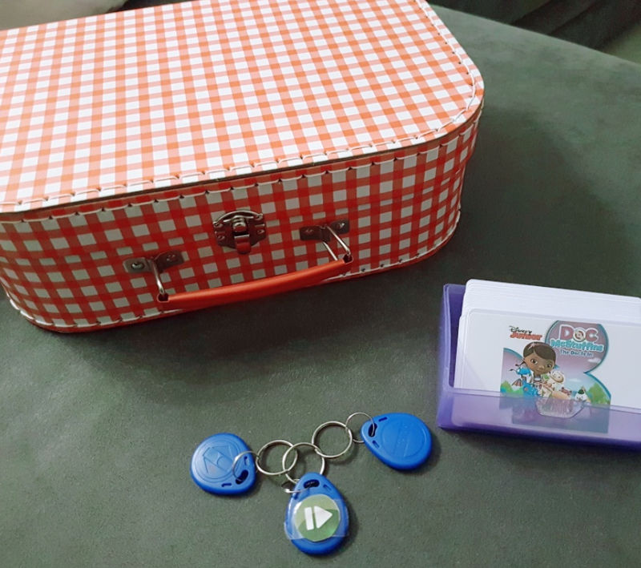 |
| [tullm](https://github.com/tullm)'s suitcase jukebox is travel ready.  | It also runs the Mopidy music server for files for playing files on the NAS and from Spotify. (Jan 2018) |
| 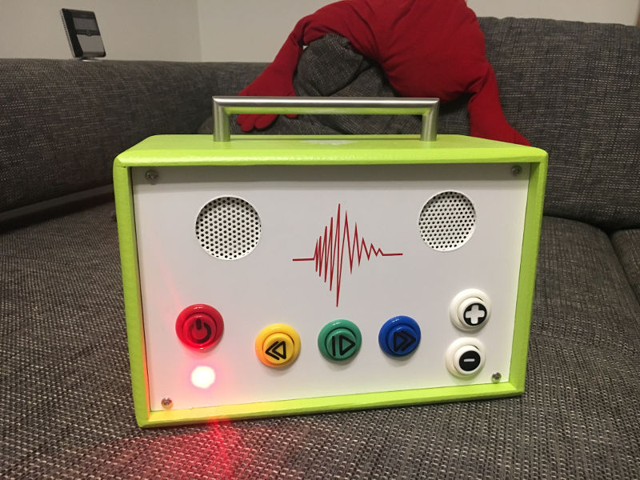 | 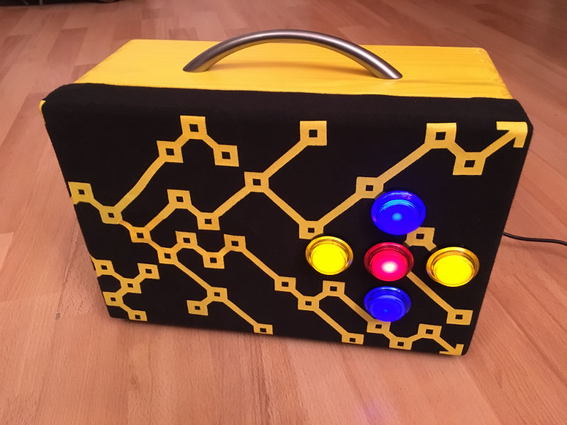 |
| [KingKahn123](https://github.com/KingKahn123) featuring the gpio buttons. (Dec 2017) | Jens Braeuer's design on eye level with TRON (Jan 2018) |
| 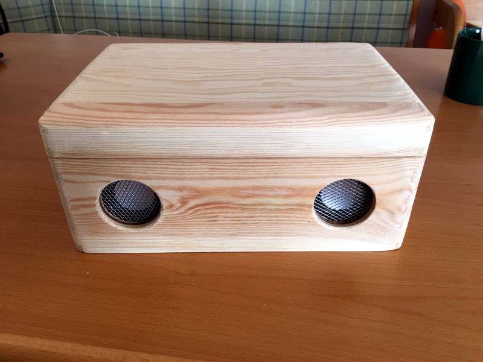 | 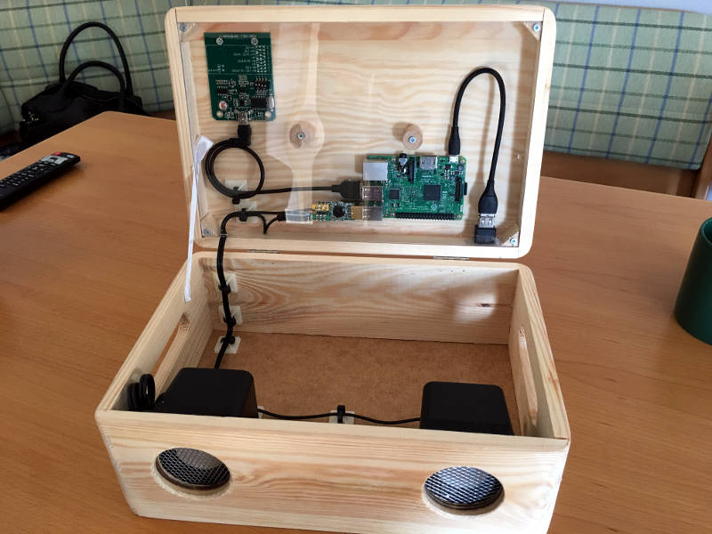 |
| [bgraeb](https://github.com/bgraeb)'s neat wooden box. (May 2018) | Slick on the outside and stylish on the inside. |
| 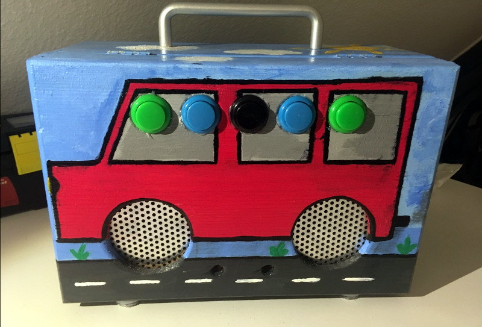 | 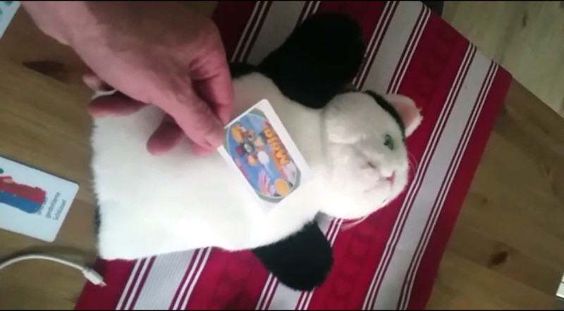 |
| The mobile jukebox by [hailogugo](https://github.com/hailogugo) who also provided the first GPIO py script. (Dec 2017) | Ulli Hallerbach's cat won't feature buttons - how could it? (Nov 2017) |
| 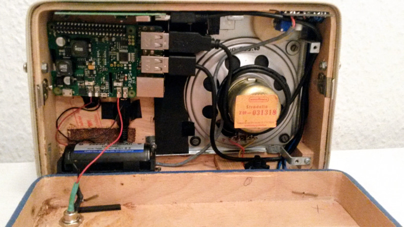 | 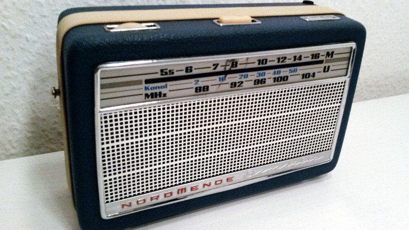 |
| Cramped space for a RPi3 a 3 Watt amp and power bank... | ... all wrapped in Markus' portable vintage radio. (Nov 2017)  |
