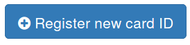
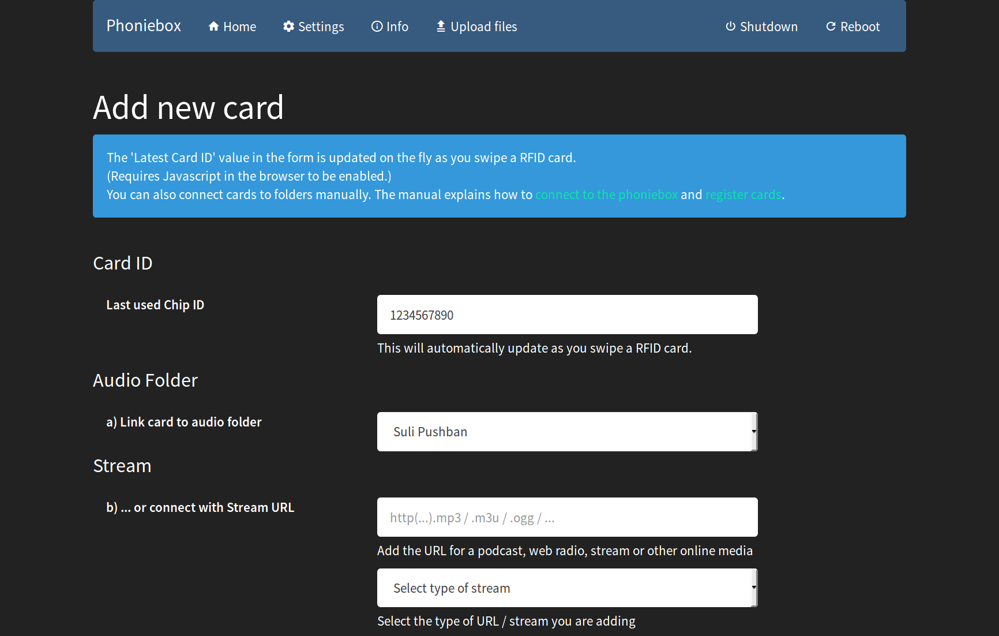

# Phoniebox Manual

Before you can run the Phoniebox, you need to have it installed and configured.
Make sure to go through the [installation](INSTALL-stretch.md) and [configuration](CONFIGURE-stretch.md) first.

In this manual you will learn:

* [How to connect to the Phoniebox from any computer to add and edit audio files.](#connect)
* [How to register new RFID cards, assign them a *human readable* shortcut and add audio files for each card.](#registercards)
* [How to add webradio stations and other web streams to the playout files](#webstreams) - [and even mix web based and local files.](#mixwebstreams)
* [How to control the Phoniebox through the web app.](#webapp)
* [How to assign cards specific tasks such as changing the volume level or shutting down the Phoniebox.](#cardcontrol)

## Changing Phoniebox settings

There is a folder called `settings` which contains audio and card settings. How to change the card settings, you will find below in this document. Here is a list of the other available settings.

### `settings/Audio_iFace_Name`
This is a file containing a string, by default `PCM`.

Inside `settings/Audio_iFace_Name` is the **iFace name** of the sound card. By default for the RPi this would be `PCM`. But this does not work for every setup. If you are using *phatbeat* as a DAC for example, you need to change the content of `Audio_iFace_Name` from `PCM` to `Master` or `Speaker`. Other external sound cards might use different interface names. To see if `PCM` could work for you, type `amixer sget PCM`.
To list all available iFace names, type `amixer scontrols`.

### `settings/Max_Volume_Limit`
This is a file containing a number, by default `100`.

If one is **using an audio amplifier** (like the pHAT BEAT) without a physical volume limiter (like a potentiometer) your Phoniebox can get very loud "accidentally". The maximal volume can be set in `settings/Max_Volume_Limit`.

### `settings/Audio_Volume_Change_Step`
This is a file containing a number, by default `3`.

Changing this number affects the `volumeup` and `volumedown` function in the web app or triggered by RFID cards. Increasing the number will result in larger volume jumps. Decreasing the number will result in smaller changes of the volume.

### `settings/Idle_Time_Before_Shutdown`
This is a file containing a number, by default `0`.

### `settings/Latest_RFID`
Contains the latest RFID used, which could start an audio playout but might also 
control the system (e.g. volume up or shutdown). 
Created in script `rfid_trigger_play.sh`

### `settings/Latest_RFID_Played`
Contains the latest RFID that triggered an audio folder
piped to `playout_controls.sh -c=playlistaddplay -v=...`
Created in script `rfid_trigger_play.sh`

### `settings/Latest_Folder_Played`
Contains the last folder that was played. 
Created in `playout_controls.sh` AND `rfid_trigger_play.sh` (currently all play triggers - webapp and RFID are
piped through `rfid_trigger_play.sh`. So it seems redundant. But who knows if at a later dev stage
some scripts might use only `playout_controls.sh`). 

This feature is helpful for powerbank users who want to save battery power. It shuts down the idle Phoniebox after a specified number of minutes.
If you want to use the *idle shutdown* feature, you can specify the number of minutes in this file, after which the Phoniebox will shut down when either the audio player is not playing and/or the sound has been muted.

**IMPORTANT: if you do not want to use auto shutdown, the number in the file must be 0**

## Connecting to the Phoniebox to add files

You need to connect to the Phoniebox in order to manage audio files and register new RFID cards. There are two ways to connect to the Phoniebox.

1. Using SSH to log into the Phoniebox
2. Connect over the home network

Most of the Phoniebox management should be done with the second option: connecting over your home network. This is the easiest way to add and remove audio files, because you are using your file manager to copy and paste files onto the Phoniebox. Copying files to the Phoniebox using the SSH login is actually more complicated.

### Connecting over SSH

Find out more about how to [connect over SSH from Windows, Mac, Linux or Android on the official RPi page](https://www.raspberrypi.org/documentation/remote-access/ssh/).

### Connecting with Apple Mac OS X

* Start the **Finder** application.
* Select **Go** pulldown menu and go to **Connect to server...**
* As the server address, type `smb://` followed by the IP address of your Phoniebox. In my case this would be: `smb://192.168.178.199`
* The following screen requires you to login as a **Registered User**. Name and password are the ones you specified when installing the *Samba* server. I suggested to use `pi` and `raspberry`.
* Selecting **Remember this password...** will connect to the Phoniebox automatically.
* Now, if you go to the finder, at the bottom left menu under *Shared* you will find the IP address of your Phoniebox.
* Clicking on the IP in the left menu will open the files on the Phoniebox. Under `pi_network` you should see: `audiofolders`, `shotcuts`, `placeholder` and once you registered RFID cards also the file `latestID.txt` (all of which will be explained later).

### Connecting with Linux / Ubuntu

* Open the windows manager.
* Navigate to **Network** in the left menu or select **File** > **Connect to server...** from the pulldown menu.
* Clicking from **Network** to **Windows Network** will bring you to the Raspberry Pi home network.
* If you chose **File** > **Connect to server...**, type `smb://` followed by the IP address of your Phoniebox. In my case this would be: `smb://192.168.178.199`
* In both cases, you will be exposed to the login screen eventually.

## Registering a new RFID card or key fob

Registering a card means: linking the card ID to an action (like: volume up) or a folder (containing audio files or a link to a podcast or live stream). Then, when swiping the card, the audio folder is being played or the action performed. 

### Registering cards using the web app

The easiest way to add and edit cards is done using the web app. Let's start with an empty Phoniebox. This assumes that you might already have audio files on the Phoniebox. How that's done you can see below.

#### Link a new card to a folder or stream
* Go to the web app (i.e. open the Phoniebox's IP address in the browser of a connected device/PC).
* Near the top of the page you will find a button saying "Register new card ID". Click it. 

* This will bring up a form looking like this:

The card ID will be updated as you swipe a new card over the Phoniebox. Do not try to edit the card ID manually, it will revert to the last swiped ID.
* Either select an audio folder in the drop down menu near the top OR
* Add the URL of a webradio, podcast, live stream, select the type of stream and give this new stream a name.
* Press 'submit' and you are set.

### Edit card through web app

On the home page you will find a link in the list of audio folders to the card that is registered to this folder. Click the card ID with the wrench next to it, so come to the edit form.

### Registering cards manually (through samba without the web app)

This is how you figure out the ID of a RFID card:

1. Boot up the Phoniebox.
2. Swipe the RFID card across the Phoniebox (you should hear a 'beep' sound when the reader recognises the card).
3. Open the shared folder in your windows manager over the home network (see above for details on how to connect).
4. Open the file `latestID.txt` by double clicking it. This file contains the information you need.

The file contains information about the card like the following:

~~~~
Card ID '0594672283' was used at '2017-02-02.12:26:08'.
This ID has been used before.
The shortcut points to audiofolder 'stop'.
~~~~

The first line lists the ID of the card: `0594672283`.

The second line tells us that the card has been used before. Note that every time you swipe a card, the file `latestID.txt` is being created. Therefore it is very likely this file notes a card has been used before.

The third line is giving us information about a *human readable* shortcut given to this ID. In this case, there is a folder named `stop` - which can contain audio files or text files with links to web streams.

### Making a 'human readable' shortcut for a card

Imagine you have a card with a sticker of birds on it. Every time somebody swipes the bird card across the Phoniebox, you want it to play a lot of bird sounds. And when you add or delete birds from the playlist, you don't want to need to know the card ID. You just want to drop the files into a folder called `birds`.

This is why you can assign *human readable* names for card IDs. This is how you do it:

1. Swipe the card across the Phoniebox.
2. Open the file `latestID.txt` to find out the card ID (e.g. `0594672283`).
3. Navigate to the folder `shortcuts` in your windows manager.
4. Open the file of the same name as the card ID with a text editor.
5. Change the content of that file to `birds`

Now you have told the Phoniebox that every time the card with the ID `0594672283` is swiped across, play what's in the folder `birds`. Let's continue and make that folder and the audio files inside.

**Important:** 
* Make sure your editor does not add a line break at the end of the shortcuts file. It must only contain the folder name.
* If your folder contains white spaces (e.g. `bird songs`) do not escape the white spaces in the shortcuts file (e.g. do NOT write `bird\ songs`).
* If you are linking a subfolder, add the relative path to your audio folder. Correct: `animal songs/bird songs`. Not correct: `home/pi/RPi-Jukebox-RFID/shared/audiofolders/animal songs/bird songs`.

### Adding new audio files and create a playlist for a new card

Following the previous step, we now have a card that triggers the Phoniebox to seek the folder `birds` and play the contents of that folder as an audio playlist. This is how you create the folder and fill it with content:

1. Open your windows manager and connect to the Phoniebox via the home network.
2. Navigate to the folder `audiofolders`.
3. Create a new folder inside this folder called `birds`.
4. Copy audio files into this folder.

That's it. If you swipe the card across the Phoniebox, it will play all the files in the folder `birds`.

**Note:** files are played in alphabetical order. If you want to change the order, rename the files accordingly.

### Show covers in web app

If your audio folder contains a file called `cover.jpg` (lowercase!) it will be displayed in the web app above the player controls.

### Playing audio files from a USB stick

If you have your audio files on an external USB stick, you need to point the folder `audiofolders` to the external USB device. The USB-stick is automatically mounted to `/media/usb0`.

You can do this by creating a symbolic link to the USB stick with the following command:

~~~
ln -s /media/usb0/* /home/pi/RPi-Jukebox-RFID/shared/audiofolders/
~~~

To make the USB stick fully accessible to the web app, too, here is what you need to do:

#### Read and write to USB via web app

Assuming your USB stick has been formatted to FAT32 (which is the common format allowing easy access in Windows and OSX), you need to install `usbmount` to mount the stick automatically.
~~~
sudo apt-get install usbmount
~~~
In Rasbian `stretch` change the config file:
~~~
sudo nano /lib/systemd/system/systemd-udevd.service
~~~
and change `MountFlags=slave` to `MountFlags=shared`.
Now you can see the USB stick under `/media/usb0`. But it is read only, not writeable. To change that, edit the config:
~~~
sudo nano /etc/usbmount/usbmount.conf
~~~
And add the following:
~~~
FS_MOUNTOPTIONS="-fstype=vfat,flush,gid=users,uid=33,umask=007,iocharset=utf8"
~~~
The problem are the access rights for the user `pi` and `www-data` (the webserver). The above line fixes this, because:

* `pi` is part of `gid=users`
*  `www-data` has the `uid=33`

This is work in progress, please share more insights in the [issue section](https://github.com/MiczFlor/RPi-Jukebox-RFID/issues).

### Adding webradio station and other online streams

In short:

* Create a folder inside `shared/audiofolders/`
* Add a textfile inside the new folder containing the URL of the stream (see below for naming conventions)
* Assign the new folder to a card ID (see above)

An audio stream from the web can mean two things:

1. A live stream that plays endlessly (e.g. webradio station).
2. A clip or file on the web that has a URL (e.g. soundcloud audio file).

These two are actually very different and will result in different behaviour of the Phoniebox. A live web stream never stops. This means that it will continue to play until you shut down the machine or start something else by swiping a different card across the Phoniebox.

A static file on the web is more or less the same as a local file. The Phoniebox will play the content of the file and once it's finished, it will be idle waiting for the next card or continue playing the next file in the folder (see about mixing audio files and web streams in the next section).

This is how you add a web stream to a specific card:

Firstly, you need to get the URL from the file or stream.

* **Static files**: these will point straight to the file and will look something like this: `http://www(...)/filename.mp3`
* **Web radio streams**: often, radio stations list their URL to the stream. In some cases, they link to a file ending with e.g. `m3u` or `.pls`. This would be a playlist which in turn will contain the stream URL. Save the file, open it with a text editor and use the last URL inside (sometimes the first URLs play jingles).

Now you are ready to add the stream to your Phoniebox.

1. Register the card, create a shortcut and the matching folder as described above.
2. Navigate to the folder you just created.
3. Create a text file ending with `.txt`. For streams use `livestream.txt` (because I am working on podcasts and `podcast.txt` will be processed differently, same goes for `spotify.txt` at a later stage). 
4. Open the text file and copy the URL of the live stream (or static file) into the file.

That's it. Now, if you swipe with the card, the Phoniebox will open the matching folder, open the text file and send the content to the audio player.

**Good to know:** you can find a number of radio stations at the [Community Radio Browser](http://www.radio-browser.info). When you find a station you like, click on the *Save* icon which will download a file `radio.pls`. You can open this file with a text editor and within the file find the URL of the live web radio stream.

**Troubleshooting:** 
* if you are playing files with a high quality, they might break off and/or stutter. This is a buffering issue. See troubleshooting at the end of this document. 
* if you add a web stream or URL which is invalid, this might create the audio player to revert to what it played the last time it was launched. If your Phoniebox seems to become erratic, check the URLs in your audio folder.

### Mixing audio files and web streams

As described above, the media player will (attempt to) play any content it finds in a folder in alphabetical order. I decided to work with the audio player because it is very robust and really tries to play anything it can. This means it also mixes audio files and web streams.

If you want to create such a mix, simply mix the content inside the audio folder. The Phoniebox will play all content in alphabetical order. Keep this in mind if you plan the order of the playlist.

**Note:** if you add a URL from a live web station to the playlist, the Phoniebox will never get to play the files after this URL - because the live radio never stops.

### Adding podcasts

The podcast feature allows you to play a podcast on your Phoniebox. The latest episode will be played automaticall. Using the previous and next option on the web app, with RFID cards or GPIO buttons, you can skip to other episodes as you would in any other playlist. The number of episodes the Phoniebox will play depends on the number of episodes listed in the podcast.

In short:

* Create a folder inside `shared/audiofolders/`
* Add a textfile named `podcast.txt` inside the new folder containing the podcast URL 
* Assign the new folder to a card ID (see above)

**Good to know:** A podcast is an RSS-feed containing a list of items featuring the special `enclosure` tag. This special tag has the `url` attribute pointing to an audio file on the web. The file ending for a podcast is often `.rss` or `.xml`. 

## The Phoniebox Web App

You can control the Phoniebox with your mobile phone, smart TV or through a browser on a computer. On any device connected to the same WiFi home network as your Phoniebox, open the browser and type in the static IP address of your Phoniebox. If you do this on your phone, the web app should something look like this:

### Change the volume level

At the top of the page, you can select the volume level in a pulldown menu. Hit *Set volume* and the volume on your Phoniebox will be changed. This change will remain active even after a reboot.

### Play and list audio files

All the folders and containing audio files are listed in the web app. In case there are more folders on the Phoniebox than RFID cards in use, you can also play the audio files which have no corresponding RFID card using the web app.

Scroll to the folder you want to play and hit the *Play* icon left of the folder name. This will start the playout on the Phoniebox.

If you want to see the files contained inside an audio folder, click on the folder name. This will list the content beneath the folder name. A second click on the folder name will hide the list of files again.

### Stop playout

At the top of the page you can see the *Stop Player* icon. If you are using a mobile device, this option might be hidden within the navigation, in which case, click the hamburger icon to see the *Stop Player* option.

Click on the *Stop Player* icon to stop the playout on the Phoniebox.

### Shutdown the Phoniebox gracefully

At the top of the page, on the right side, you can see the option *Shutdown*. If you are using a mobile device, this option might be hidden within the navigation, in which case, click the hamburger icon to see the *Shutdown* option.

Click on *Shutdown* to shutdown the RPi gracefully. While it is perfectly save to shutdown the RPi the hard way by unplugging the power supply, it is being rumoured that a graceful shutdown extends the life expectancy of the SD card in your RPi. I have no clue if that is true and scientifically proven.

If you use the *Shutdown* option, unplug the RPi power supply after the machine has shut down to save energy.

## Phoniebox controls using RFID cards

This requires you to connect to the Phoniebox over SSH, because it requires to edit a script on the machine. Find out more about how to [connect over SSH from Windows, Mac, Linux or Android on the official RPi page](https://www.raspberrypi.org/documentation/remote-access/ssh/).

If you are unsure about connecting over SSH, you can also take the Phoniebox and connect it to a monitor, keyboard and mouse and work on the machine directly.

The main file controlling the Phoniebox and the audio playout is called:

~~~~
/home/pi/RPi-Jukebox-RFID/scripts/rfid_trigger_play.sh
~~~~

This script operates in two stages. Firstly, it attempts to match the card ID with a command that controls the Phoniebox. If there is no match, it will move on and look for a folder which is associated with the card that contains audio material - and play the content.

If you want to assign certain control commands with RFID cards, firstly register the card to find out the unique ID (see above for details).

The commands which are available in the script are:

* **CMDMUTE** - will mute the Phoniebox. The file(s) continue to play, but there will be no sound coming out.
* **CMDVOL30** to **CMDVOL100** - sets the volume to the percentage passed on, being one of: 30%, 50%, 75%, 85%, 90%, 95%, 100%.
* **CMDVOLUP** and **CMDVOLDOWN** - increases or decreases the volume by the percentage step defined in 

* **CMDSTOP** - stop the media player (without changing the volume).
* **CMDSHUTDOWN** - shutdown the Phoniebox. While you can switch off the RPi the hard way by unplugging it from the power source, in the long run using the proper shutdown method extends the life expectation of your Phoniebox. After the shutdown, you still should detach the power supply - if only to make sure the speakers don't drain power.
* **CMDREBOOT** - reboot the Phoniebox

* **CMDNEXT** and **CMDPREV** - to skip one track forward or backward
* **CMDPAUSE** and **CMDPLAY** - pause and resume audio playout

* **STOPAFTER5** to **STOPAFTER60** - timer to stop after x minutes
* **SHUTDOWNAFTER5** to **SHUTDOWNAFTER60** - timer to shutdown the Phoniebox after x minutes

* **DISABLEWIFI** and **ENABLEWIFI** - toggle wifi like with cellphones in airplane mode, to increase battery live and reduce radiation

* **CMDSHUFFLE** - toggle shuffle mode (not only for the current playlist)

Once you have logged in to the RPi over SSH or booted with monitor and keyboard attached, open the script in the nano editor:

~~~~
$ nano /home/pi/RPi-Jukebox-RFID/settings/rfid_trigger_play.conf
~~~~

Scroll down until you see the list of available commands:

~~~~
CMDMUTE="%CMDMUTE%"
CMDVOL30="%CMDVOL30%"
CMDVOL50="%CMDVOL50%"
CMDVOL75="%CMDVOL75%"
CMDVOL80="%CMDVOL80%"
CMDVOL85="%CMDVOL85%"
CMDVOL90="%CMDVOL90%"
CMDVOL95="%CMDVOL95%"
CMDVOL100="%CMDVOL100%"
CMDVOLUP="%CMDVOLUP%"
CMDVOLDOWN="%CMDVOLDOWN%"
CMDSTOP="%CMDSTOP%"
CMDSHUTDOWN="%CMDSHUTDOWN%"
CMDREBOOT="%CMDREBOOT%"
~~~~

Change the values of the commands you want to assign, leave the other ones unchanged. In our example, the changed list might look like this:

~~~~
CMDMUTE="1352647584"
CMDVOL30="%CMDVOL30%"
CMDVOL50="%CMDVOL50%"
CMDVOL75="%CMDVOL75%"
CMDVOL80="%CMDVOL80%"
CMDVOL85="%CMDVOL85%"
CMDVOL90="%CMDVOL90%"
CMDVOL95="%CMDVOL95%"
CMDVOL100="%CMDVOL100%"
CMDVOLUP="984000025364"
CMDVOLDOWN="2636453782"
CMDSTOP="%CMDSTOP%"
CMDSHUTDOWN="%CMDSHUTDOWN%"
CMDREBOOT="%CMDREBOOT%"
~~~~

Save the changes and close the editor. The changes takes effect immediately.

**Note:** if you (accidently) assign a command and an audio folder to the same card, the Phoniebox will not play the audio. It will only execute the command.

# Troubleshooting / FAQ

## The web app isn't showing up

If you have the webserver `apache` running on your Pi when installing Phoniebox, the web app is not showing. Unistall `apache` to fix this. Phoniebox is using the webserver `lighttpd`.

## The album covers are not displayed in the web app

If your audio folder contains a file called `cover.jpg` (lowercase!) it will be displayed in the web app above the player controls.

* Possibly your file is named differently? Like `Cover.JPG` or `cover.jpeg`?
* Make sure the group www-data has the rights to see the file (i.e. the webserver can read it).

## I moved my audiofiles now the playout does not work

If you are moving your audio files to a different location, you need to edit two files to make sure Phoniebox (in alliance with mpd) can still play the content.

~~~
nano /home/pi/RPi-Jukebox-RFID/settings/Audio_Folders_Path
~~~
... needs to contain the absolute path to your folder containing other audio folders. And so does the variable `music_directory` in the config file of `mpd`:
~~~
sudo nano /etc/mpd.conf
~~~
Once you have these changed, update mpd:
~~~ 
sudo service mpd restart
mpc update
~~~

## I want to improve the onboard audio quality

The Pi onboard audio quality is not the best. If you don't intend to go with an external USB card, these hints might help to improve the quality. Please share your experience in the "issues" section on github. These suggestions might depend on your operating system, so don't just throw them all in the mix :) Here you can find a [good list of audio improvements to try](https://github.com/superjamie/lazyweb/wiki/Raspberry-Pi-3.5mm-Audio-Hiss). What seems to work for many:

* **Setting 'audio dither'**: The onboard audio output uses config options to change the way the analogue audio is driven, and whether some firmware features are enabled or not. See the official Raspberry page for [more information on `disable_audio_dither` and `enable_audio_dither`](https://www.raspberrypi.org/documentation/configuration/config-txt/audio.md).
* **Settings for PMW driver**: Available in newer Raspbian as of Feb 2016  is a PWM audio driver that significantly increases the audio quality available from the 3.5mm TRRS jack. In `/boot/config.txt` add the following line: `audio_pwm_mode=2`
* **Firmware update**:  If you want to update the RPI firmware, this is the right point to do so. This manual was written for the default firmware. Read more about how to update and why you might want to give it a try in a separate [Firmware Update document](FIRMWARE_UPDATE.md).

## I am moving, how do I get the Phoniebox into my new WiFi network?

You will need to open the Phoniebox and connect it to a monitor. The next question would be: do you need the graphical interface or are you good to go with the command line in the terminal window?

If you need the command line only, disconnect the RFID reader but leave the WiFi in the USB. If you need keyboard and mouse for the GUI, you need a USB hub to connect keyboard and mouse to, then unplug the RFID reader and plug the hub in. (Note: if you have a RPi3 or higher, you are not limied to two USB slots and don't have that trouble :)

If you want to do this in the GUI, type
~~~
$ startx
~~~
And you are good to go.

If you want to do it in the command line, here you can read more about the [WiFi configuration in the terminal on a Raspberry Pi](https://www.raspberrypi.org/documentation/configuration/wireless/wireless-cli.md).

What you need to do, in a nutshell: open the file with your WiFi SSID and password.

~~~
$ sudo nano /etc/wpa_supplicant/wpa_supplicant.conf
~~~
Edit the content to fit your SSID and password here:
~~~
network={
    ssid="testing"
    psk="testingPassword"
}
~~~
Save the changes with `Ctrl & O` then `Enter` then `Ctrl & X`.

The second thing: give your Phoniebox an IP address that is free in your WiFi to use. Change the IPv4 configuration inside the file `/etc/dhcpcd.conf`.
~~~~
$ sudo nano /etc/dhcpcd.conf
~~~~
In my case, I added the following lines to assign the static IP. You need to adjust this to your network needs:

~~~~
interface wlan0
static ip_address=192.168.178.199/24
static routers=192.168.178.1
static domain_name_servers=192.168.178.1
~~~~
Save the changes with `Ctrl & O` then `Enter` then `Ctrl & X`.

## Audio is not working

This might occur if you are using external sound cards like *pHat BEAT* or the like. I split this into two parts: a) sound did never work and b) sound worked once, now, with a new soundcard, it doesn't.

**a) Audio never worked**

This could happen if you are using an external soundcard. Generally, if you have audio troubles, try searching the web, because it might get complicated. But try this first:

Learn here why [to specify the audio iFace](https://github.com/MiczFlor/RPi-Jukebox-RFID/blob/master/docs/MANUAL.md#settingsaudio_iface_name) in the file `settings/Audio_iFace_Name`. 

If that doesn't work, check if the device is recognised by your Pi:
~~~
$ cat /proc/asound/modules
0 snd_bcm2835
1 snd_usb_audio
~~~
This shows that device 1 is the usb audio card.
Open the sound configuration file.
~~~
$ sudo nano /usr/share/alsa/alsa.conf
~~~
Now replace the lines near the end of the file:
~~~
defaults.ctl.card 0
defaults.pcm.card 0
~~~
with:
~~~
defaults.ctl.card 1
defaults.pcm.card 1
~~~
Now the audio card for the system is set to 1. Reboot the RPi:
~~~
$ sudo reboot
~~~

**b) Audio worked, then you changed the sound card and it stopped working**

If you change your sound card, you need to alter the configuration in two parts by adding the iFace name:

* Inside `settings/Audio_iFace_Name` of your Phoniebox installation
* Inside `/etc/mpd.conf`

During the install procedure, both files are set using `PCM`. After you added your sound card, you need to alter these two files. In `mpd.conf` you can find a section which looks like this:
~~~
audio_output {
	type		"alsa"
	name		"My ALSA Device"
#	device		"hw:0,0"	# optional
#	mixer_type      "hardware"      # optional
#	mixer_device	"default"	# optional
	mixer_control	"%AUDIOiFace%"		# optional
#	mixer_index	"0"		# optional
}
~~~
Replace `%AUDIOiFace%` with the iFace name of your device. Other values might also need to be changed. Consult the `mpd` manual for details.

"How do I get the right iFace name?", you might wonder. Rightly so. In short: type `amixer scontrols` - and read the following section to find out more.

### `hifiberry DAC+` soundcard details

Read [Hifiberry info on volume control](https://www.hifiberry.com/build/documentation/adding-software-volume-control/) for details.

According to the upper guide you need to configure the _/etc/mpd.conf_ file. And especially the _audio_output_ section needs some updating:
~~~
audio_output {
        enabled         "yes"
        type            "alsa"
        name            "HiFiBerry DAC+ Lite"
        device          "hifiberry"
        auto_resample   "no"
        auto_channels   "no"
        auto_format     "no"
        dop             "no"
}
~~~

What the guide does not say is, that in the audio_output section, there are several deviced preconfigured but commented out.
Amongst others, the first default device is
~~~
audio_output {
        type               "alsa"
        name            "My ALSA Device"
}
~~~
These four lines must not be commented out but active (in addition to the hifiberry entries).

## Changing the volume does not work, but the playout works

If you change your sound card, you need to alter the configuration in two parts by adding the iFace name:

* Inside `settings/Audio_iFace_Name` of your Phoniebox installation
* Inside `/etc/mpd.conf`

Jumpt to the section which covers [changes after changing the audio card](#faqAudioChangedSoundcard) to see more.

## daemon_rfid_reader.py only works via SSH not by RFID cards
`daemon_rfid_reader.py` works perfectly when running through SSH manually. However, when running at reboot, it does not play the audio files when triggered by RFID tag. This can happen when cron runs them too early in the boot process.

Solution: Delay running the script by 60 secs.
~~~
@reboot sleep 60 && mpg123 /home/pi/RPi-Jukebox-RFID/misc/startupsound.mp3
@reboot sleep 60 && python2 /home/pi/RPi-Jukebox-RFID/scripts/daemon_rfid_reader.py &
~~~

## Script is closed unexpectedly

In some cases it might occur that the `daemon_rfid_reader.py` script is colsed by the system unexpectedly. In this case you can add another script to check regularly if the script is still running and if not, restart it. Created the following shell script named `chk_daemon_rfid_reader.sh` in the folder `/home/pi/RPi-Jukebox-RFID/scripts/`

~~~
# check rfid_reader_daemon
ps -ef | grep -v grep | grep python2
# if not found - equals to 1, start it
if [ $? -eq 1 ]
then
python2 /home/pi/RPi-Jukebox-RFID/scripts/daemon_rfid_reader.py &
else
echo "eq 0 - rfid_reader_daemon found - do nothing"
~~~

Make the file executable:
~~~
chmod +x /home/pi/RPi-Jukebox-RFID/scripts/chk_daemon_rfid_reader.sh
~~~

Run this script every minute by adding the following line via crontab:
~~~
* * * * * /home/pi/RPi-Jukebox-RFID/scripts/chk_daemon_rfid_reader.sh &
~~~

## The RFID Reader doesn't seem to work

There could be many reasons why the RFID Reader is not working reliably or behaves strangely. This could be due to a weak power supply or an insuficient power bank. Worth trying out before you try anything else.

If you used the install script, you might have forgotten to register your RFID card reader. See the section *Register your USB device for the Phoniebox* inside [CONFIGURE-stretch.md](CONFIGURE-stretch.md) (if you are still running *jessie*, see [CONFIGURE-jessie.md](CONFIGURE-jessie.md). 

## Everything seems to work, but I hear nothing when swiping a card

If the RFID reader works, and also the ID cards are listed in the `latestID.txt` and the WebApp plays audio correctly, but the cards don't start the audio playout, this is what could be the issue:

* Make sure your editor does not add a line break at the end of the shortcuts files you are editing. It must only contain the folder name you want to trigger.

## I would like to use two cards / IDs to do the same thing

In this example, you will create two cards to do the same thing: set the volume level to 95%.
After you installed the box and it works, to be safe, make a backup of the daemon script:
~~~
cp /home/pi/RPi-Jukebox-RFID/scripts/rfid_trigger_play.sh /home/pi/RPi-Jukebox-RFID/scripts/rfid_trigger_play.sh.backup
~~~
If you make a mistake, you can revert your changes with this command:
~~~
cp /home/pi/RPi-Jukebox-RFID/scripts/rfid_trigger_play.sh.backup /home/pi/RPi-Jukebox-RFID/scripts/rfid_trigger_play.sh
~~~
Then open the script in a text editor. At the top of the script you need to add new variables for the master keychain. As an example, let's say the volume setting for 95% is on both chains. Currently there is only one:
~~~
CMDVOL95="%CMDVOL95%"
~~~
You will add another:
~~~
CMDVOL95="%CMDVOL95%"
CMDMASTERVOL95="%CMDMASTERVOL95%"
~~~
Once you filled in your IDs, it will look something like this:
~~~
CMDVOL95="123456789"
CMDMASTERVOL95="987654321"
~~~
Now you also duplicate the section in the script below and do the same thing for both cards. Now it says:
~~~
elif [ "$CARDID" == "$CMDVOL95" ]
then
    # amixer sset 'PCM' 95%
    $PATHDATA/playout_controls.sh -c=setvolume -v=95
~~~
Once you made the changes, it will say this:
~~~
elif [ "$CARDID" == "$CMDVOL95" ]
then
    # amixer sset 'PCM' 95%
    $PATHDATA/playout_controls.sh -c=setvolume -v=95

elif [ "$CARDID" == "$CMDMASTERVOL95" ]
then
    # amixer sset 'PCM' 95%
    $PATHDATA/playout_controls.sh -c=setvolume -v=95
~~~

## Using Logitech V20 Speaker

They Logitech V20 Speaker has some keys and will be recognized as normal usb keyboard input. The following script can be added to make these recognised by Phoniebox (kudos to contributor [ekorn](https://github.com/ekorn):
~~~
#File with Phoniebox keybindings for the Logitech V20 Speaker
#loadkeys /home/pi/RPi-Jukebox-RFID/misc/mykeys

#play/pause
string F100 = "/home/pi/RPi-Jukebox-RFID/scripts/playout_controls.sh -c=playerpause\n"
string F101 = "/home/pi/RPi-Jukebox-RFID/scripts/playout_controls.sh -c=playerstop\n"
string F102 = "/home/pi/RPi-Jukebox-RFID/scripts/playout_controls.sh -c=playerprev\n"
string F103 = "/home/pi/RPi-Jukebox-RFID/scripts/playout_controls.sh -c=playernext\n"
#mute/unmute
string F104 = "amixer -c 1 set PCM 1+ toggle\n"
string F105 = "/home/pi/RPi-Jukebox-RFID/scripts/playout_controls.sh -c=volumeup\n"
string F106 = "/home/pi/RPi-Jukebox-RFID/scripts/playout_controls.sh -c=volumedown\n"

keycode 164 = F100
keycode 166 = F101
keycode 165 = F102
keycode 163 = F103
keycode 113 = F104
keycode 115 = F105
keycode 114 = F106
~~~
and add it to the end of the /etc/rc.local to autostart it and make sure that the pi user is loged in so that the key inputs work with raspi-config->Boot Options->Autologin Text Console

## Recoder functionality
If you are using a external sound card with micro line in, phoniebox is able to record the audio.
The recordings can be controlled with the commands STARTRECORD600 (starts recording for max 10 minutes) and STOPRECORD. A RFID card can be assigned in rfid_trigger_play.conf

~~~
STARTRECORD600 ="%STARTRECORD600%"
STOPRECORD = "%STOPRECORD%"
~~~

If a recording is already is runnig, no other recording will be started.
The recordings will be stored in the $audiofiles/Recordings, the filename contains date and time of the record start.
   
