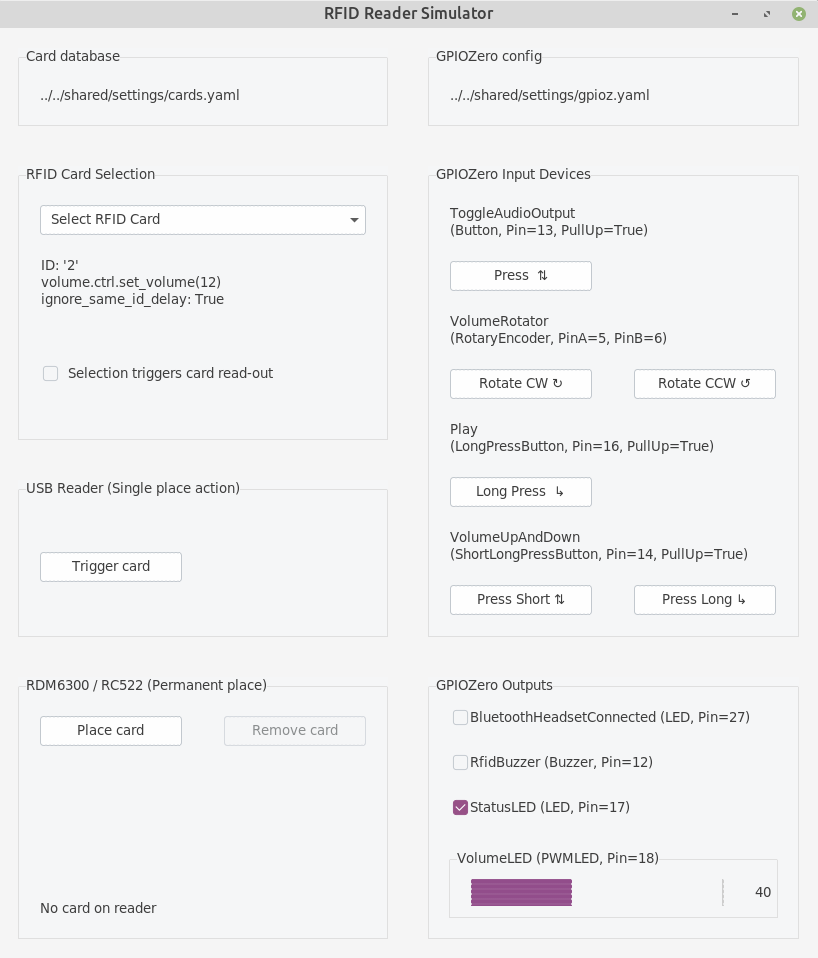

# GPIO Recipes

## Enabling GPIO

The GPIO module needs to be enabled in your main configuration file ``shared/settings/jukebox.yaml``. Look for this entry and modify it accordingly:

```yml
gpioz:
  enable: true
  config_file: ../../shared/settings/gpio.yaml
```

The GPIO configuration itself is stored in a separate file, in this case ``../../shared/settings/gpio.yaml``.

The GPIO module uses [GPIOZero](https://gpiozero.readthedocs.io/) as a backend to access the RPi's GPIO pins.
It's a wrapper to integrate GPIOZero into the Jukebox's API, allowing a YAML based configuration and providing helpful error messages on misconfiguration.

## Pin Numbering

The pin numbering is the BCM pin numbering, as is the
[default in GPIOZero](https://gpiozero.readthedocs.io/en/stable/recipes.html#pin-numbering>).

## Configuration

The GPIOZ configuration file has the following structure:

```yml
pin_factory:
  type: rpigpio.RPiGPIOFactory
output_devices:
  ...
input_devices:
  ...
```

There is no need to touch the header, but some [Developer options](#developer-options) can be found there.

A file with examples can be found in ``resources/default-settings/gpio.yaml``.
Below you will find easy to adapt recipes for various configuration snippets.

## Input devices

Configuring input devices consists of 2 aspects:

1. Define an input device and configure it's parameters. All available
input devices can be found in class `components.gpio.gpioz.core.input_devices`.
2. Assign an action to execute on input state change.
Actions are defined as [RPC Commands](rpc-commands.md),
just the same as for assigning card actions.

### Button: Toggle Playback

A button to toggle music playback on single press:

```yml
input_devices:
  TogglePlayback:
    type: Button
    kwargs:
      pin: 13
    actions:
      on_press:
        alias: toggle
```

Each device instantiation must be uniquely named, here  ``TogglePlayback``. The name can be freely chosen, as
long as it is unique.

The parameter ``type`` directly matches the GPIO input device class, in this case
class `LED <components.gpio.gpioz.core.input_devices.Button>`. With ``kwargs`` you can set all the class initialization
parameters, which relate directly to the class' initialization parameters.

> [!IMPORTANT]
> You cannot set the class initialization parameters attribute `pin_factory` or attribute `name`
> from inside ``kwargs``. The name is automatically assigned from the unique name of configuration entry.

Usually, only the pin(s) are mandatory parameters. In the section ``actions``, the RPC commands are linked,
either as alias (i.e. shortcut) or full [RPC Commands](rpc-commands.md) specification.

The default configuration of the Button uses the internal pull-up resistor. So, the physical connection to
the RPi looks:

```text
 ----+
     |      1 kOhm   Button
   13| -----======------/ ----+
     |                        |
 ----+                        - GND
```

### Button: Increase volume

A button to increase the volume by 5 steps every 0.75 seconds as long as it is pressed:

```yml
input_devices:
  IncreaseVolume:
    type: Button
    kwargs:
      pin: 13
      hold_time: 0.75
      hold_repeat: True
    actions:
      on_press:
        alias: change_volume
        args: +5
```

### Button: Shutdown

A button to shutdown the Jukebox if it is pressed for more than 3 seconds. Note the different ``type`` here!

```yml
input_devices:
  Shutdown:
    type: LongPressButton
    kwargs:
      pin: 3
      hold_time: 3
    actions:
      on_press:
        alias: shutdown
```

### Button: Dual Action

A button to act differently on short and long presses. Go to previous song on single short press, start playlist from
the beginning on press longer than 1 second.

> [!NOTE]
> the short press action is executed on button release since we don't not know how much longer somebody is going
> to press the button. The long press action is executed as soon as the hold time has been reached.

```yml
input_devices:
  PreviousSong:
    type: ShortLongPressButton
    kwargs:
      pin: 13
      hold_time: 1
    actions:
      on_short_press:
        alias: prev_song
      on_long_press:
        alias: replay
```

### TwinButton: Six function beast

Use two buttons to encode up to six actions depending on single / dual press and also short / long press.
Single button short presses skip to prev/next song, while long presses decrease/increase the volume.
Here we also use make use of attribute `hold_repeat`, to have the volume continue to change for as long as we hold the button
down. Twin press toggle pause or changed the audio output sink from speakers to headset. The attribute attribute `hold_repeat`
only applies to single press actions, never to dual press actions.

```yml
input_devices:
  SixActionBeast:
    type: TwinButton
    kwargs:
      a: 12
      b: 13
      hold_repeat: true
    actions:
      on_short_press_a:
        alias: prev_song
      on_short_press_b:
        alias: next_song
      on_short_press_ab:
        alias: toggle
      on_long_press_a:
        alias: change_volume
        args: -3
      on_long_press_b:
        alias: change_volume
        args: 3
      on_long_press_ab:
        alias: toggle_output
```

With a TwinButton not all functions need to be assigned. A button that only does prev/next song and causes as
shutdown only on dual press with a minimum hold time of 2 seconds looks like this:

```yml
input_devices:
  CombinationButton:
    type: TwinButton
    kwargs:
      a: 12
      b: 13
      hold_time: 2
    actions:
      on_short_press_a:
        alias: prev_song
      on_short_press_b:
        alias: next_song
      on_long_press_ab:
        alias: toggle_output
```

### Rotary Encoder: Volume Control

A rotary encoder to change the volume: A common module is the KY-040, which can be picked up from numerous shops.
It has four pins, typically labelled DT, CLK, SW, GND. Connect GND to ground. Connect DT and CLK to the
RPi with a 1 kOhm resistor each - these are pins ``a`` in ``b`` in the configuration. If later the rotation
direction does not match, simply swap the pins in the configuration file. The pin SW (for switch) is not always
present. It is a button when the rotary encoder is pressed from the top. Configure a
regular button entry separately for this button, e.g. [Button Toggle Playback](#button-toggle-playback).

```yml
input_devices:
  VolumeRotator:
    type: RotaryEncoder
    kwargs:
      a: 5
      b: 6
    actions:
      on_rotate_clockwise:
        alias: change_volume
        args: 5
      on_rotate_counter_clockwise:
        alias: change_volume
        args: -5
```

### Rotary Encoder: Previous/Next Song

From the previous recipe, simply replace the actions to have a rotary encoder to step through the playlist:

```yml
        ...
        actions:
          on_rotate_clockwise:
            alias: next_song
          on_rotate_counter_clockwise:
            alias: prev_song
```

## Output devices

Configuring output devices contains 2 aspects:

1. Define the the output device. Available output devices can be found in class `components.gpio.gpioz.core.output_devices`.
2. Connect the device to some Jukebox function which then
activates the device on e.g. RFID card read. There are many predefined connections
available. Check them all out in class `components.gpio.gpioz.plugin.connectivity`

### Buzzers

There are two different types of buzzers:

#### Active buzzer

These buzzers make a single-frequency beep sound when a constant voltage is applied. A common module is
the KY-012. These buzzers must be mapped to class `components.gpio.gpioz.core.output_devices.Buzzer`.

#### Passive buzzer

These buzzers must be used with a PWM signal but then can emit different frequency beeps. This is all handled
by us. A common module is the KY-006. These buzzers _must_ be mapped to class `components.gpio.gpioz.core.output_devices.TonalBuzzer`

#### General

For many connection function is does not matter if a class `components.gpio.gpioz.core.output_devices.Buzzer`
or a class `components.gpio.gpioz.core.output_devices.TonalBuzzer` is connected.
The connection function takes care of the differences internally - as long as the class matches the physical hardware device!

### Status LED

An LED that lights up when the Jukebox service is operational.

```yml
output_devices:
  StatusLED:
    type: LED
    connect:
      - gpio.gpioz.plugin.connectivity.register_status_led_callback
    kwargs:
      pin: 17
```

As with the input devices, every output device requires a unique, but freely chosen name - here ``StatusLED``.
The parameter ``type`` directly matches the GPIO output device class, in this case
class `components.gpio.gpioz.core.output_devices.LED`.
The parameters in ``kwargs`` relate to the class initialization parameters.

The ``connect`` option is a list of functions to call to connect this device with a function inside
the Jukebox. An output device can be used by multiple functions.

> [!IMPORTANT]
> You cannot set the class initialization parameters attribute `pin_factory` or attribute `name`
> from inside ``kwargs``. The name is automatically assigned from the unique name of configuration entry.

### Card Read Buzzer

Sound a Piezzo Buzzer once when a card swipe has been detected. For unknown cards, sound it 3 times.

```yml
output_devices:
  RfidBuzzer:
    type: Buzzer
    connect:
      - gpio.gpioz.plugin.connectivity.register_rfid_callback
    kwargs:
      pin: 12
```

### Card Read + Volume + Status Buzzer

Extend the card read buzzer to also sound one long beep after completed boot up and two beeps on shutdown.
On top sound a short beep when minimum or maximum volume is reached.
The only difference is the two additional connection functions.

```yml
output_devices:
  RfidBuzzer:
    type: Buzzer
    connect:
      - gpio.gpioz.plugin.connectivity.register_rfid_callback
      - gpio.gpioz.plugin.connectivity.register_status_buzzer_callback
      - gpio.gpioz.plugin.connectivity.register_volume_buzzer_callback
    kwargs:
      pin: 12
```

### Tonal Status Buzzer

Have an active buzzer play a 4 note melody on startup and a 3 note melody on closing down.
Use the same buzzer to beep on RFID card swipes.

```yml
output_devices:
  RfidBuzzer:
    type: TonalBuzzer
    connect:
      - gpio.gpioz.plugin.connectivity.register_status_tonalbuzzer_callback
      - gpio.gpioz.plugin.connectivity.register_rfid_callback
    kwargs:
      pin: 12
```

### Card Read LED

Just like `Card Read Buzzer`, but flash a LED instead of buzzing a sound. The difference is the output device type.

```yml
output_devices:
  RfidLED:
    type: LED
    connect:
      - gpio.gpioz.plugin.connectivity.register_rfid_callback
    kwargs:
      pin: 12
```

### Volume LED

Have a LED change it's brightness to reflect the current volume level. It also flashes when minimum or maximum volume level is reached.

```yml
output_devices:
  VolumeLED:
    type: PWMLED
    connect: gpio.gpioz.plugin.connectivity.register_volume_led_callback
    kwargs:
      pin: 18
```

### Color Volume LED

Have an RGBLED change it's color to reflect the current volume level. It also flashes when minimum or maximum
volume level is reached. RGBLED's can be found as modules, e.g. KY-016 or KY-009, or as individual components from any electronics shop.

```yml
output_devices:
  VolumeLED:
    type: RGBLED
    connect: gpio.gpioz.plugin.connectivity.register_volume_rgbled_callback
    kwargs:
      pin: 18
```

### Bluetooth audio output LED

Indicates the current audio output sink. LED is off when audio sink is primary sink, and
on when audio sink is secondary sink (e.g. a bluetooth headset). When sink toggle fails, LED blinks 3 times.

```yml
output_devices:
  HeadsetConnected:
    type: LED
    connect:
      - gpio.gpioz.plugin.connectivity.register_audio_sink_change_callback
    kwargs:
      pin: 27
```

## Developer options

For developers there are 2 options. Both replace the pin factory used by GPIOZero.

### Use Mock Pins

Using GPIOZero [Mock pins](https://gpiozero.readthedocs.io/en/stable/api_pins.html#mock-pins),
allows to do function development on an arbitrary machine. If you have
configured the [Mock RFID Reader](../developers/rfid/mock_reader.md),
the GPIO input and output devices are added to the GUI. Simply change the header in the configuration file to:

```yml
pin_factory:
  type: mock.MockFactory
```



### Use Remote Pins

Using [GPIOZero's remote pins](https://gpiozero.readthedocs.io/en/stable/remote_gpio.html)
allows to run the Jukebox code on a single machine and have the GPIO
happen on a RPi board. See the GPIOZero documentation how to set it up.
Simply change the header in the configuration file to enable it. Host is the IP address of your RPi board.

```yml
pin_factory:
  type: pigpio.PiGPIOFactory
  pigpio.PiGPIOFactory:
    kwargs:
      host: 192.168.178.32
```
