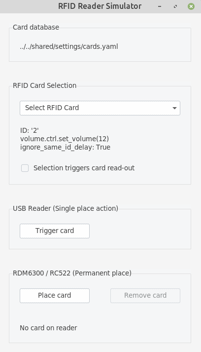

# Mock Reader

A fake reader using a TK GUI for development purposes. This target
software development which does not happen on the RPi but on another
machine - probably in a Python virtual environment.

**place-capable**: yes

If you [mock the GPIO pins](../../builders/gpio.md#use-mock-pins), this GUI will show the GPIO devices.



> [!NOTE]
> When using Anaconda, the GUI will look horrible! That's because Anaconda's TK is compiled without FreeType support.
>
> There is a very quick and very dirty [fix](https://stackoverflow.com/questions/47769187/make-anacondas-tkinter-aware-of-system-fonts-or-install-new-fonts-for-anaconda).
> Replacing the TK lib in Anaconda's environment with the system `libtk`.
> However, this depends on an exact version match of the `libtk`.
>
> ``` bash
> cd /path/to/anaconda3/envs/rpi/lib
> mv ./libtk8.6.so ./libtk8.6.so.bak
> ln -s /usr/lib/x86_64-linux-gnu/libtk8.6.so libtk8.6.so
> ```
>
> An alternative is to simply use Python's `venv` module to create a virtual environment. This uses your systems Python version and thus will work with your system `libtk`. It might not be the RPi's Python version - but that should not matter in most cases.
