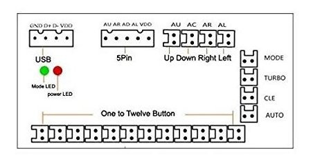

# Buttons USB Encoder

Taken from [issue 1156](https://github.com/MiczFlor/RPi-Jukebox-RFID/issues/1156).

Supports functionality of buttons which are connected via USB Encoder. The USB Encoder is the easy solution for anyone
who doesn't want to solder, but also wants arcade buttons.

Tested Devices:

* [IGames Zero Verzögerung USB Encoder](https://www.amazon.de/gp/product/B01N0GZQZI)
* [EG STARTS Nullverzögerung USB Encoder](https://www.amazon.de/gp/product/B075DFNK24)

## Usage

1. Plug in your USB Encoder. You don't need to install any drivers. After plugging in, the USB encoder acts like an
   input device.
2. Run the script `setup-buttons-usb-encoder.sh` to set up your USB Encoder (choose the device and map the buttons).

